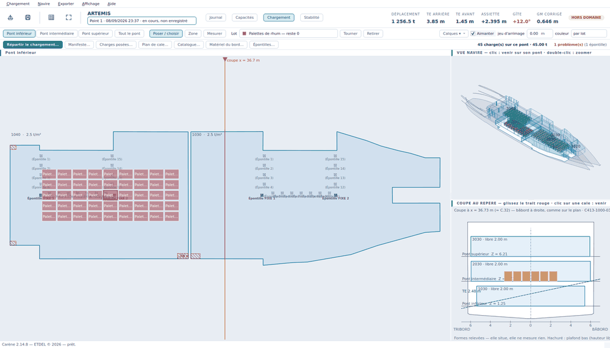

# Bienvenue dans Carène

Cette page décrit ce que Carène sait faire, ce qu'il ne fait pas, et comment
est bâtie la fenêtre dans laquelle vous allez travailler.

## Ce que Carène fait

Carène compose un chargement et calcule l'état du navire qui en résulte :

- il tient le **relevé des soutes et ballasts** et en tire poids, centres de
  gravité et carènes liquides, lus dans les tables de jaugeage du dossier ;
- il tient le **manifeste** de ce qu'on embarque et laisse **poser chaque
  colis** sur le plan des ponts, à l'endroit exact où il ira ;
- il calcule l'**équilibre** — tirants d'eau, assiette, gîte — puis la
  **courbe GZ** et les **critères réglementaires** ;
- il propose un **premier jet de répartition** de la cargaison et une
  **manœuvre de ballastage** pour redresser ou tenir l'assiette ;
- il **sort les documents** de l'escale : rapport de stabilité, relevés, plan
  de chargement, feuilles de pointage.

## Ce que Carène ne fait pas

> **Carène est une aide au chargement et à la stabilité. Il n'est ni certifié
> ni réglementaire : le dossier de stabilité approuvé du navire fait foi.**

Concrètement, cela veut dire :

- les chiffres affichés valent ce que valent les **tables du dossier installé**
  et les **relevés que vous saisissez**. Carène n'invente aucune donnée de
  navire ;
- dès que le calcul sort du domaine couvert par les tables, il l'annonce
  (`HORS DOMAINE`) au lieu de présenter une valeur extrapolée comme un
  résultat ;
- Carène n'applique **aucune règle de ségrégation IMDG**, ne modélise ni le
  chemin des fourches, ni les pompes, ni l'ordre des manœuvres ;
- il ne remplace ni le calcul du dossier approuvé, ni l'appréciation du
  capitaine.

Un rappel de cet avertissement s'affiche une fois à chaque lancement, et il
figure en tête de la vue *Stabilité* et sur chaque document exporté.

## La fenêtre principale

L'**en-tête**, en haut de l'écran, tient sur une rangée sur un grand écran et
**passe à la ligne** sur une fenêtre étroite : rien n'en disparaît jamais, il
prend seulement une ligne de plus. Il se lit de gauche à droite :

| Repère | Ce que c'est |
|---|---|
| La barre de menus | *Chargement*, *Journal*, *Navire*, *Exporter*, *Affichage*, *Aide* — voir [Les menus, un par un](menus.md) |
| Les boutons, à gauche | les gestes du quotidien, écrits en toutes lettres : **Enregistrer** (le point), **Exporter / imprimer**, **Recalculer**, **Recadrer** (la vue), **Aide** |
| Le nom du navire | l'unique navire de cette installation |
| La liste déroulante à côté | le **point du journal** sur lequel vous travaillez ; en changer demande confirmation ; la liste finit par *＋ Nouveau point…* |
| Les trois boutons de vue | *Capacités*, *Chargement*, *Stabilité* — le journal, lui, s'ouvre par son menu ou `F2` |
| Les six chiffres | le bandeau permanent (voir plus bas) |
| La voilure et la pastille | la **voilure** portée, et le **verdict** du cas en cours |

## Les vues

Trois vues de travail, et le journal. On passe de l'une à l'autre par les
boutons de l'en-tête, par le menu *Affichage*, ou par les touches **F2** à
**F5**. Chaque vue emporte ses propres panneaux : il n'y a pas de colonne
permanente qui ne servirait qu'à la moitié du travail.

| Vue | Touche | À quoi elle sert |
|---|---|---|
| **Journal** | `F2` (menu *Journal*) | la chronologie des points du navire : choisir sur quel point on travaille, en ouvrir un nouveau, enregistrer, figer — voir [Le point de chargement](point_de_chargement.md) |
| **Capacités** | `F3` | relever soutes, ballasts et caisses, et ballaster — voir [Les capacités](capacites.md) |
| **Chargement** | `F4` | poser la cargaison sur le plan des ponts — voir [Charger à la main](chargement.md) |
| **Stabilité** | `F5` | les résultats complets, les critères, le relevé des tirants d'eau et le dossier — voir [La stabilité](stabilite.md) |

Les deux vues graphiques montrent chacune **son objet** : la vue *Capacités*
ne dessine que les capacités liquides, la vue *Chargement* ne dessine que les
cales et les colis qu'on y a posés. Sur un plan de ponts, les deux sont
tracées côte à côte ; les mélanger rendrait les deux illisibles.

## Le bandeau et son verdict

Le bandeau ne porte que les grandeurs qu'on doit avoir sous les yeux **pendant
qu'on charge**. Tout le reste est dans la vue *Stabilité*.

| Case | Ce qu'elle dit |
|---|---|
| **DÉPLACEMENT** | le poids total du navire, en tonnes : lège + liquides + cargaison + poids divers |
| **TE ARRIÈRE** | le tirant d'eau arrière, lu dans la table du navire — pas reconstruit |
| **TE AVANT** | le tirant d'eau avant, de même |
| **ASSIETTE** | la différence, en mètres. Convention du dossier : **positif = enfoncement arrière** |
| **GÎTE** | la gîte d'équilibre, en degrés. Elle passe en **rouge au-delà de 5°** |
| **GM CORRIGÉ** | le GM après correction des carènes liquides — le chiffre qui dit si le navire est raide ou mou |

La pastille de droite résume le cas d'un mot :

| Verdict | Ce qu'il veut dire | Ce qu'on en fait |
|---|---|---|
| **CONFORME** | tous les critères évalués sont passés | on peut continuer |
| **NON CONFORME** | au moins un critère est manqué | ouvrir `F5` pour voir lequel |
| **HORS DOMAINE** | l'équilibre trouvé sort des tables du dossier (hydrostatiques **ou** pantocarènes) | les chiffres sont extrapolés et **sans valeur réglementaire** : corriger le chargement ou le ballast |
| **NON ÉVALUABLE** | aucun équilibre stable n'a été trouvé dans le domaine des pantocarènes | le cas ne tient pas debout tel qu'il est saisi |
| **—** | rien n'a encore été calculé | `Ctrl+R` (*Affichage › Recalculer*) |

Le calcul se relance tout seul à chaque modification. *Affichage › Recalculer*
(`Ctrl+R`) le force, par exemple après avoir changé le dossier du navire.
*Affichage › Recadrer la vue* (`F`) remet le cadrage et le zoom de la vue
graphique en cours sans changer l'angle de l'isométrie.

## Une installation, un navire

Carène ne gère **qu'un seul navire par installation**. Il s'ouvre tout seul au
lancement ; sa définition (tables, capacités, plans) se fait une fois pour
toutes dans une fenêtre à part — voir [Le navire](navire.md).

## Trouver de l'aide, et signaler un problème

- *Aide › Aide de Carène…* ou **F1** ouvre ce document. La fenêtre reste
  ouverte pendant que vous travaillez : les plans restent cliquables. Ses
  boutons **PDF…** et **Imprimer…** sortent la page affichée ou le manuel
  entier.
- Le bouton **Aide** de l'en-tête fait la même chose.
- *Aide › Signaler un problème…* prépare un message au développeur avec ce
  qui tournait et le journal technique — voir [Réglages et
  dépannage](reglages.md). Un chiffre douteux, une fenêtre qui se ferme :
  dites-le, un problème qu'on ne signale pas ne se corrige pas.
- Dans le [répartiteur](repartiteur.md) et dans l'[éditeur de plans](navire.md),
  un bouton **?** ouvre directement la page qui les concerne.
- *Affichage › Infobulles d'aide* rallume les bulles au survol des boutons et
  des champs — voir [Réglages et dépannage](reglages.md).

## Suite

[Premiers pas](premiers_pas.md) — une première escale de bout en bout, dans
l'ordre ; puis [Le point de chargement](point_de_chargement.md).
