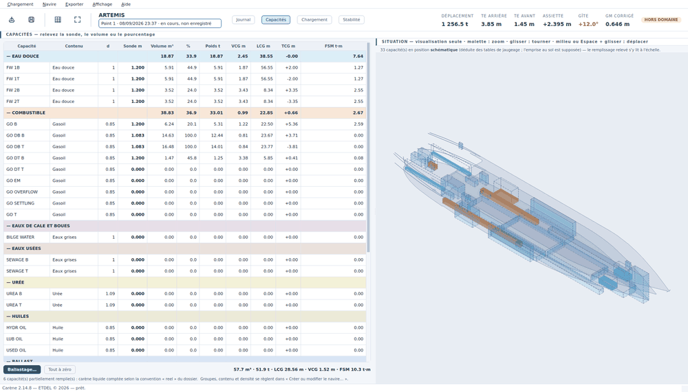

# Les capacités : soutes et ballasts

Cette page explique comment relever soutes, ballasts et caisses, ce que
signifie chaque colonne du tableau, et comment faire chercher une manœuvre de
ballastage.

## Ouvrir la vue

*Affichage › Capacités* (`F3`), ou le bouton **Capacités** du bandeau.

À gauche le **tableau de toutes les capacités du navire**, à droite la
**situation** en vue isométrique, où le remplissage relevé se voit à l'échelle.

## Il n'y a rien à ajouter ni à retirer

Le tableau porte **toutes les capacités du navire, dès l'ouverture**. Les
capacités appartiennent au navire, pas au chargement : leur nom, leur
**contenu** (ballast, gasoil, huile, eau douce…) et leur **densité** se règlent
une fois pour toutes dans *Navire › Créer ou modifier le navire… › Capacités
et jaugeages* — voir [Le navire](navire.md).

Les lignes sont groupées par nature (eau douce, combustible, ballast, huiles,
eaux usées…) avec un sous-total par groupe, et chaque groupe porte sa teinte.

> Une capacité présente dans un point ancien mais **disparue du navire** reste
> affichée en rouge, hors calcul, plutôt que d'escamoter un poids sans le dire.

## Le geste : relever une mesure

Ici, on ne fait que **relever ce qui a été mesuré à bord**. Trois colonnes de
mesure, une seule vérité : celle qu'on tape.

1. Cliquez la cellule de la colonne qui correspond à votre mesure —
   **Sonde m**, **Volume m³** ou **%**.
2. Tapez la valeur, validez.
3. Les deux autres colonnes se mettent à jour en passant par la **table de
   jaugeage** du navire ; la colonne que vous avez saisie reste en gras, les
   deux autres passent en gris parce qu'elles en découlent.

Ce marquage sert plus tard : on retrouve ce que le bord a **réellement lu**, et
non une valeur reconstituée.

Le bouton **Tout à zéro**, en bas, vide toutes les capacités — utile pour
repartir d'un navire lège.

### La densité, quatrième grandeur du relevé

La colonne **d** se tape comme les trois mesures. Le dossier donne la densité
de chaque contenu (1,025 pour l'eau de mer, 0,850 pour le gazole) ; mais la
livraison de gazole d'aujourd'hui fait 0,840 et le ballast pris en estuaire
est saumâtre. Cliquez la cellule, tapez la densité relevée : le poids et le
moment de carène liquide de la capacité suivent, la ligne passe en **gras
teinté** et l'infobulle rappelle la valeur du dossier. **Le dossier n'est pas
touché** : c'est la densité *de ce point de chargement*, enregistrée avec lui.

Ce qui change et ce qui ne change pas : le **poids** est le volume lu dans la
table de jaugeage multiplié par la densité tapée ; le **moment de carène
liquide** suit dans le même rapport (c'est un moment d'inertie de surface
multiplié par la densité) ; la sonde, le volume, le pourcentage et les
centres (LCG, TCG, VCG) ne bougent pas — ils ne dépendent que de la
géométrie de la capacité.

Pour revenir au dossier : effacez la case, ou clic droit › **Densité du
dossier (0,850)**. Clic droit › **Appliquer cette densité à tout le groupe**
la reporte sur toutes les capacités du même groupe (combustible, eau douce,
ballast…) : une livraison a une densité, pas une par caisse. Une densité
nulle, négative ou supérieure à 3 est refusée.

## Ce que disent les colonnes

| Colonne | Ce que c'est | D'où ça vient |
|---|---|---|
| **Capacité** | le code du dossier (« GO DB B », « WB 2C ») | le navire |
| **Contenu** | la nature du liquide | le navire |
| **d** | la densité du contenu — celle du dossier, ou celle que vous avez relevée pour ce point (en gras teinté) | le navire, **ou** relevée |
| **Sonde m** | la hauteur de liquide mesurée | relevée **ou** déduite |
| **Volume m³** | le volume correspondant | relevé **ou** déduit |
| **%** | le taux de remplissage | relevé **ou** déduit |
| **Poids t** | volume × densité | table de jaugeage |
| **VCG m** | hauteur du centre de gravité du liquide | table de jaugeage |
| **LCG m** | position longitudinale de ce centre | table de jaugeage |
| **TCG m** | position transversale (positif = bâbord) | table de jaugeage |
| **FSM t·m** | le moment de carène liquide de la capacité | table de jaugeage |

Rien n'est calculé dans cette vue : poids, centres et carène liquide sont
**lus** dans les tables du dossier — et, si vous avez relevé une densité,
poids et carène liquide sont remis à l'échelle de cette densité-là.

## Les carènes liquides

Une capacité partiellement remplie a une surface libre : le liquide se déplace
quand le navire s'incline, et cela **coûte du GM**. C'est le **FSM**.

- Le FSM passe en **orange** dès que la capacité est partiellement remplie :
  c'est là qu'il mord.
- La somme des FSM (ΣFSM) est reportée dans la vue [Stabilité](stabilite.md) ;
  c'est elle qui fait l'écart entre **GM solide** et **GM corrigé**, le second
  étant celui du bandeau.
- La **convention** appliquée (FSM maximal de la capacité, ou FSM réel au
  remplissage) est celle du **dossier du navire**, pas un choix du logiciel.
  La ligne d'état sous le tableau la rappelle, et dit combien de capacités sont
  partiellement remplies.

La règle pratique en découle : **une capacité pleine ou vide ne coûte rien ;
une capacité à moitié pleine coûte**. C'est pourquoi le solutionneur de
ballastage évite les ballasts partiels.

## La vue de situation

À droite, l'isométrie ne montre **que les capacités** — les cales appartiennent
à la vue [Chargement](chargement.md). Le liquide y est dessiné à sa hauteur
réelle.

- molette : zoom ; glisser : tourner ; bouton du milieu (ou `Espace` + glisser) :
  déplacer ; `F` : recadrer.
- **Choisir une capacité l'allume** : cliquez sa ligne dans le tableau, ou
  cliquez-la dans l'isométrie (ce qui choisit aussi sa ligne). Elle passe en
  orange, dessus, plancher et parois, devant les autres capacités — une soute
  au fond de la coque ne reste pas cachée. Elle reste allumée pendant qu'on
  relève les sondes.
- Les capacités **non tracées sur un plan** restent toujours visibles, en
  position schématique déduite de leur table de jaugeage : tracer deux cales
  ne doit pas faire disparaître trente soutes. L'infobulle de chacune dit ce
  qui est supposé dans son dessin.

## Le solutionneur de ballastage

Bouton **Ballastage…** en bas de la vue, ou *Chargement › Ballastage…* (`F8`).

On lui dit **sur quels ballasts on accepte de jouer** et **ce qu'on
s'autorise**, il cherche la meilleure répartition et la propose.

### 1. Ce qu'on s'autorise

| Choix | Effet |
|---|---|
| **Ballaster et déballaster librement (prise et rejet à la mer)** | le volume d'eau à bord est libre |
| **Transfert seul : le volume d'eau à bord ne change pas** | l'eau ne fait que passer d'un ballast à l'autre, au mètre cube près — pour les eaux où le rejet est interdit, ou quand on tient à son port en lourd |

Puis deux objectifs, cochables séparément :

- **Viser une gîte de** — 0° est ce qu'on veut presque toujours. Une gîte non
  nulle se vise à dessein (travaux sur la coque, prise d'eau à dégager).
  Décochez pour laisser la gîte libre.
- **Viser une assiette de** — en mètres, **positif = enfoncement arrière**.
  Décochez pour ne chercher que la gîte.

### 2. Ballasts sur lesquels jouer

La liste porte les ballasts du navire. **Tout cocher** / **Tout décocher**
d'un geste ; décochez ceux qu'on ne touchera pas (un ballast condamné, une
manœuvre déjà lancée).

### 3. Chercher, lire, appliquer

**Chercher** lance la recherche. Le rapport donne un **avant / après** chiffré
— gîte, assiette, TE AV/AR, déplacement, GM, ΣFSM, eau embarquée, nombre de
ballasts partiels — puis les **manœuvres**, en mètres cubes par capacité.

**Appliquer ce ballastage** les écrit dans le relevé **en volume** : c'est ce
qu'on commande à la pompe. La sonde se relèvera après la manœuvre et remplacera
cette valeur.

### Ce qu'il cherche, dans cet ordre

1. redresser la **gîte** ;
2. tenir l'**assiette visée** ;
3. garder le meilleur **GM corrigé** ;
4. embarquer le **moins d'eau** possible.

Une **zone morte** (0,2° de gîte, 2 cm d'assiette) marque l'objectif atteint :
personne ne commande un demi-mètre cube pour un dixième de degré. Les ballasts
laissés **partiellement remplis** sont évités — c'est du FSM en pure perte —
mais autorisés quand la cible l'exige ; le rapport dit alors lesquels.

### Ce qu'il faut savoir avant de s'y fier

- **Hors domaine** : si la configuration proposée sort des tables, elle n'est
  jamais présentée comme exploitable et **Appliquer reste grisé**. Le
  solutionneur sait néanmoins dans quel sens ramener un navire qui part déjà
  hors tables, et le dit franchement si le ballast seul n'y suffit pas.
- C'est une **bonne solution vérifiée, pas un optimum démontré** : une descente
  locale suivie d'un réglage fin. On peut toujours la reprendre à la main.
- Pendant la recherche, la gîte est estimée par l'approximation des petits
  angles ; celles du départ et de la solution retenue sont recalculées
  exactement sur les pantocarènes — d'où un écart possible de l'ordre du
  centième de degré.
- Il ne connaît **ni les pompes, ni les collecteurs, ni les temps de
  manœuvre** : il dit *quoi*, pas *comment ni dans quel ordre*. Il ne vérifie
  pas la stabilité **pendant** le transfert, seulement l'état final.
- Il ne contraint pas le **tirant d'eau maximal admissible** ni l'immersion des
  marques : seule la borne des tables l'arrête.

## Suite

[Le manifeste et le catalogue](manifeste.md) — ce qu'on va embarquer.
