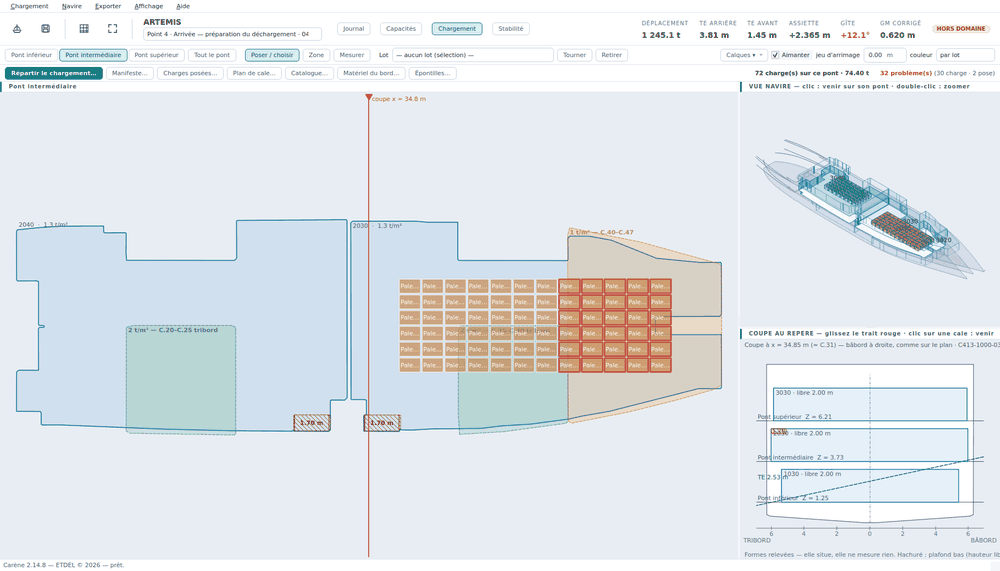

# Charger à la main

Cette page décrit le geste de chargement : prendre un lot, le poser, le
tourner, le retirer — et comprendre ce que Carène refuse et pourquoi.

## Ouvrir la vue

*Affichage › Chargement* (`F4`), ou le bouton **Chargement** du bandeau.

L'écran se lit en quatre zones :

- au centre, la **vue de dessus d'un pont entier**, à l'échelle, sur le plan
  calé s'il y en a un. Son titre, au-dessus, dit quel pont est montré, ou —
  quand on est zoomé — quelle cale et sur quel pont ;
- en haut à droite, la **VUE NAVIRE** en isométrie : un clic amène sur le pont
  d'une cale, un double-clic zoome dessus (dans le plan aussi). Elle dessine les **colis réellement
  posés**, chacun à son emprise, à sa couleur et à sa hauteur empilée ;
- dessous, la **COUPE AU REPÈRE** : on glisse le trait rouge le long du navire
  pour voir la coupe à cet endroit, avec les hauteurs libres et le tirant d'eau ;
- à gauche, la **condition de chargement** (récapitulatif, manifeste, poids
  divers).

## Les deux barres

Elles sont rangées par groupes, chacun sous une petite étiquette grise.

**La première barre** — **PONT** : un bouton par pont et *Tout le pont* ;
**OUTIL** : **Sélectionner**, **Poser**, **Zone**, **Mesurer** ; **LOT** : le
sélecteur de lot, **Tourner**, **Retirer** ; **AFFICHAGE** : le menu
**Calques** et le choix de la **couleur**.

**La deuxième barre** — **CHARGEMENT** : **Répartir le chargement…**,
**Manifeste…**, **Charges posées…**, **Épontilles…**, **Brouillons…** ;
**NAVIRE** : **Catalogue…**, **Matériel du bord…** ; **POSE** : la case
**Aimanter** et le **jeu d'arrimage** ; **ÉTAT**, à droite : le compte de ce
pont (« 45 charge(s) sur ce pont · 45.00 t »), la dernière **mesure**, et le
verdict du plan — **Plan valide**, ou **N problème(s)** (voir plus bas).

### Les quatre outils, et Échap

| Outil | Ce que fait le clic |
|---|---|
| **Sélectionner** | le clic choisit un colis, un cadre tiré dans le vide sélectionne ce qu'il touche, glisser déplace, le clic droit retire. Jamais de pose |
| **Poser** | un lot en main : le fantôme suit le pointeur, le clic gauche pose. Choisir un lot dans la liste passe tout seul sur *Poser* ; « — aucun lot — » ramène à *Sélectionner* |
| **Zone** | tracez un cadre : autant de colis du lot qu'il en tient y sont posés |
| **Mesurer** | tracez un cadre : ses cotes en long, en travers et en diagonale s'écrivent dessus et **restent affichées** jusqu'à la mesure suivante, à `Échap` ou à un changement d'outil ; le résultat est aussi dans le groupe ÉTAT |

**`Échap` ramène toujours à Sélectionner** : il lâche le lot en main, annule
le cadre, le glissement ou la mesure en cours, et remet l'outil à
*Sélectionner* — où que soit le focus, sauf dans un champ de texte en cours
de frappe. Un second `Échap` vide la sélection. Le clic droit dans le vide et
« — aucun lot — » lâchent aussi le lot.

## Annuler et refaire (`Ctrl+Z`)

*Chargement › Annuler* (`Ctrl+Z`) et *Chargement › Refaire*
(`Ctrl+Shift+Z`, ou `Ctrl+Y`). **Tout ce qui modifie le chargement du point
s'annule** : un colis posé, retiré, déplacé, tourné ou empilé, une zone
calepinée, un lot ajouté au manifeste, une sonde ou un volume relevé, une
densité corrigée, un poids divers, une épontille posée ou ôtée, la voilure
portée, un brouillon chargé, un ballastage appliqué, une répartition du
solveur, la correction par les tirants d'eau. Jusqu'à **quarante** gestes en
arrière.

Le menu **dit ce qu'il va défaire** — « Annuler la pose de 3 charges »,
« Annuler le relevé de « FW 1B » », « Annuler la correction par les tirants
d'eau » — et la barre d'état le confirme après coup. Un nouveau geste efface
ce qui avait été annulé : on ne refait pas un futur auquel on a renoncé.

Trois choses qu'il ne fait pas, et c'est voulu :

- **il ne traverse pas les points.** Ouvrir un autre point du journal, ou en
  créer un nouveau, remet l'histoire à zéro : annuler d'une escale à l'autre
  n'aurait aucun sens. Le journal, lui, garde tous les points ;
- **il ne touche pas à un point figé** (c'est une archive), ni à rien quand
  le navire est ouvert en lecture seule depuis un autre poste ;
- **il ne défait pas le navire** : la géométrie, les cales, les plans et le
  catalogue ne sont pas le chargement. L'éditeur de plans a son propre
  `Ctrl+Z`, pour ses propres tracés.

Le **plan d'une cale** (double-clic dans une cale) est une fenêtre à part :
ce qu'on y fait revient en un seul bloc, et un `Ctrl+Z` de la fenêtre
principale défait toute la session de cette cale d'un coup.

## Poser un colis

1. Choisissez le **pont** dans la première barre.
2. Prenez un lot dans le sélecteur **Lot** : il annonce ce qu'il reste à poser
   (« Palettes de rhum — reste 12 »). Le groupe « Matériel du bord » y figure
   aussi.
3. Un **fantôme** suit le pointeur. `A` le fait tourner de 90°.
4. **Clic gauche** pose le colis à l'endroit du fantôme.
5. Recommencez. Un lot entièrement posé repose la pièce de lui-même.

**Quitter la pose** : `Échap` (retour à *Sélectionner*), un clic droit dans le
vide, ou « — aucun lot — » dans le sélecteur.

## Les gestes sur un colis posé

| Geste | Effet |
|---|---|
| **glisser** | déplacer le colis (magnétisme 5 cm) |
| **`R`** | tourner de 90° **sur place**, autour du centre du colis — refusé avec son motif si la place manque |
| **`P`** | épingler : le colis ne sera plus jamais déplacé par le répartiteur |
| **`Suppr`** ou **clic droit** | retirer le colis, qui retourne au « reste à embarquer » |
| **`Alt` pendant le glissement** | ni magnétisme, ni aimantation |

Le bouton **Tourner** de la barre et le bouton **Retirer** font la même chose
que `R` et `Suppr` sur la sélection.

## Le tableau des charges posées

Le bouton **Charges posées…** ouvre le tableau de tout ce qui est posé sur le
pont. Il est **synchronisé dans les deux sens** avec le plan : déplacer un
rectangle met la ligne à jour, et corriger X, Y, l'orientation ou le nombre de
niveaux dans le tableau déplace le rectangle.

Une valeur trop grande dans la colonne `Niv.` est **ramenée au maximum**, avec
le motif en barre d'état — pas acceptée en silence.

## L'outil Zone

L'outil **Zone** tire un cadre sur le plan et le fait garnir par le calepineur
du moteur — le même que le répartiteur.

1. Prenez le lot à poser.
2. Cliquez **Zone**, puis tirez un cadre.
3. Tant que vous tirez, l'aperçu montre des rangs simples ; **dès que vous vous
   arrêtez**, il montre le calepinage retenu (une quinzaine d'essais, le
   meilleur gardé).
4. Relâchez : la barre dit ce qui a été fait *et* en quoi c'est mieux —
   « 45 colis posés dans la zone (6 de plus qu'en rangs simples) ·
   disposition : transversale · jeu 0,05 m ».

Le cadre est un **souhait**, pas un découpage : ce qui refuse une pose reste le
contour de la cale, les zones interdites, les épontilles en place, les voisins,
la charge admissible et la hauteur libre. Les colis déjà posés sont des
obstacles : la zone se range autour d'eux. Un cadre à cheval sur plusieurs
cales remplit chaque cale pour sa part, et **on ne pose jamais plus que le
reste à embarquer**.

Comptez un cinquième de seconde par cale, trois quarts de seconde pour un cadre
tiré sur un pont entier.

L'outil **Mesurer** sert à prendre une cote sur le plan, sans rien poser.

## L'aimantation et le jeu d'arrimage

Les colis se **collent** : dès qu'on passe à moins de 20 cm d'un voisin ou
d'une paroi, la charge glissée vient bord à bord. Deux repères, ceux qu'on
utilise en rangeant une cale :

- **accoster** — poser contre le colis qu'on longe ;
- **aligner** — mettre son bord dans le prolongement d'un autre, pour des
  rangées droites.

Le champ **jeu d'arrimage** de la barre est le **débordement qu'on prête à
chaque colis, de chaque côté** : une palette qui s'est affaissée et dont le
contenu dépasse un peu de ses dimensions, la place des saisines, le passage
des fourches. 0 pour du jointif, 5 cm pour une cale ordinaire.

> **Le jeu d'arrimage est un débord de plus, commun à tous les colis, et il
> s'applique partout de la même façon.** Chaque colis déborde du jeu de chaque
> côté : deux voisins sont donc écartés de **deux fois** le jeu, un colis et
> la muraille d'**une fois**. Le calepinage (répartiteur, outil Zone,
> « Remplir depuis le manifeste »), l'aimantation **et la pose à la main**
> le respectent tous : une pose qui ne le laisse pas est **refusée**, et le
> motif le dit (« chevauche « … », jeu d'arrimage compris »). Il vaut pour tout
> le navire ouvert, est retenu d'un point de chargement à l'autre, et n'entre
> dans aucun fichier — les colis posés n'en gardent pas trace, c'est le
> réglage du moment qui juge. Sous 1 cm, le calepinage garde sa marge d'usine.
>
> Conséquence à connaître : un bloc de colis calepinés serrés **ne pivote
> plus sur place** (un colis tourné réclame 1,20 m là où le pas de rangée
> n'en offre que 0,80) — c'est la vérité du quai.
>
> À ne pas confondre avec le **débord**, qui est une cote de la marchandise —
> ce qui dépasse *vraiment* de la palette —, se règle au manifeste lot par
> lot, et **s'ajoute** au jeu. Voir [Le manifeste](manifeste.md).

La case **Aimanter** coupe durablement l'aimantation ; `Alt` s'en affranchit
le temps d'un glissement.

## L'empilement

Le nombre de couches ne peut pas dépasser le plus contraignant de deux
plafonds :

1. le **stack** propre à la marchandise (colonne *Stack* du manifeste) ;
2. la **hauteur libre** de la cale divisée par la hauteur d'un exemplaire.

L'info-bulle du compteur de couches, dans le plan de cale, donne le calcul.
Une charge dont **un seul exemplaire** ne tient déjà pas dans la cale n'est pas
escamotée : elle reste posée et apparaît dans les problèmes.

## Les épontilles

Une **épontille amovible** est un mur qu'on met en place ou qu'on dépose,
escale par escale. Une épontille **fixe** est de la structure : elle est
toujours là.

- **Un clic sur une épontille amovible** la met en place ou la dépose — lot en
  main ou non. C'est un mur, pas une place libre.
- *Navire › Épontilles…*, ou le bouton **Épontilles…** de la vue, ouvre la
  liste : on les met en place et on les dépose par lignes, ce qui est plus
  rapide qu'au clic quand il y en a quinze.
- Une épontille **en place** interdit la pose, et le répartiteur la contourne.
  Une épontille **déposée** est dessinée en pâle et ne gêne rien.
- Les épontilles se **tracent** dans *Navire › Créer ou modifier le navire…* —
  voir [Le navire](navire.md).

## Les brouillons du plan de chargement

*Chargement › Brouillons du plan de chargement…*, ou le bouton **Brouillons…**
de la vue. Un point du journal peut garder **plusieurs plans de cargaison côte
à côte** — deux façons de ranger la même escale — et on en **valide** un à la
fin.

Un brouillon, c'est le **manifeste, les colis posés et les épontilles en
place** — pas les liquides : les relevés des caisses appartiennent au point,
il n'y a qu'une réalité à bord. La fenêtre liste les brouillons (nom, dates,
colis, tonnage, cales servies, ✓ sur le validé) avec les boutons
**Enregistrer le plan en cours comme brouillon…** (nom proposé « Brouillon N —
date heure »), **Charger** (le plan en cours devient une copie du brouillon ;
si le plan en cours n'était pas encore un brouillon, on propose de le garder),
**Valider** (charge et marque ✓ — un seul validé à la fois), **Renommer…**,
**Supprimer**, **Ne garder que le validé**. Un brouillon est une **copie** :
retoucher le plan en cours ne le modifie pas. Sur un point figé, on regarde,
on ne charge rien. Les brouillons sont enregistrés avec le point.

## Les calques du plan

Le menu **Calques** de la barre, et *Affichage › Calques du plan de
chargement*, cochent les **mêmes cases** : ce qui est montré ou caché sur le
plan. L'état est retenu d'une session à l'autre.

| Calque | Ce qu'il montre |
|---|---|
| **Fond de plan** | le plan calé du pont sous les cales. Il sert à voir où l'on pose, il n'entre dans aucun calcul |
| **Zones de charge (t/m²)** | le calque des charges admissibles du plan des charges |
| **Hauteurs libres** | les zones à plafond bas (« hauteur libre 1.70 m ») |
| **Épontilles** | les épontilles, en place (pleines) ou déposées (pâles) |
| **Informations** | traits, repères et textes décalqués du plan. Ne contraint rien, ne se clique pas |
| **Étiquettes des colis** | le nom du colis et le compte de sa pile (« ×3 ») écrits dans son rectangle. Sur un plan très serré, les éteindre rend le dessin lisible |

Deux interrupteurs suivent, sous l'intitulé **Contrôles** :

| Contrôle | Ce qu'il fait |
|---|---|
| **Signaler la charge au m²** | compter les dépassements de charge admissible dans les problèmes et les surligner en rouge |
| **Signaler les hauteurs libres** | compter les piles trop hautes dans les problèmes et les surligner en rouge |

> **Décocher n'autorise rien.** Ce sont des réglages d'affichage de **cette
> session** : le répartiteur respecte toujours la charge admissible et la
> hauteur libre, et le rapport de stabilité dit ce qu'il dit. Éteindre le
> calque **Épontilles** ne les efface pas non plus : celles qui sont en place
> continuent d'interdire la pose.

## Le trait de coupe

Le repère de coupe (le trait que suit la vue de coupe) se glisse à la souris,
quel que soit l'outil. Il est **borné aux cales du pont affiché** : sur le
pont inférieur, on ne peut plus l'emmener sur la calette et le perdre. S'il
avait été laissé hors de ce pont, il se dessine à la cale la plus proche avec
un petit repère ◂ ou ▸, et se reprend de là.

## Zoomer sur une cale, et le menu d'une cale

Un **double-clic dans le vide d'une cale** (rien sous le pointeur, rien en
main) **zoome sur cette cale** dans la fenêtre principale ; un second
double-clic — dans la cale ou dans la marge — **revient au pont entier**. Le
bouton *Tout le pont* de la barre fait de même. Le double-clic dans la vue
navire, à droite, saute au pont de la cale et zoome dessus.

Un **clic droit dans le vide d'une cale** (rien en main — un lot en main, le
clic droit lâche le lot, comme toujours) ouvre **le menu de la cale** :

| Entrée | Ce qu'elle fait |
|---|---|
| *Zoomer sur 2040* / *Revenir au pont entier* | le même aller-retour que le double-clic |
| *Répartir automatiquement dans 2040…* | ouvre le [répartiteur](repartiteur.md) **déjà réglé pour cette seule cale** (elle seule cochée dans la liste des cales) |
| *Plan de cale de 2040…* | la fenêtre du plan de cale (ci-dessous) |
| *Sélectionner les colis de 2040* | toute la cale devient la sélection : déplacer, tourner ou retirer d'un bloc |
| *Vider 2040 — les colis retournent au manifeste* | sans question : `Ctrl+Z` les remet |

La première ligne du menu rappelle le code, le nom, le taux d'occupation et le
nombre de colis de la cale. La barre d'état nomme la cale et ces deux gestes
dès qu'on la survole.

## Le plan de cale

*Clic droit dans la cale › Plan de cale de …* ouvre **le plan de cette cale**
dans sa propre fenêtre, vue de dessus à l'échelle, sur le plan propre à la
cale s'il y en a un. C'est l'éditeur d'**une** cale, avec son bouton
*Remplir* ; le double-clic, lui, ne l'ouvre plus — il zoome.

On y retrouve les mêmes gestes (glisser, `R`, `P`, `Suppr`), plus :

- le compteur de **couches** et son info-bulle ;
- le bouton **Zones interdites…**, qui trace les rectangles inutilisables de la
  cale (épontille, descente, puits) — ils appartiennent à la géométrie du
  navire et valent pour tous les chargements ;
- le bouton **Remplir depuis le manifeste**, qui garnit la cale avec le même
  calepineur que le répartiteur.

**« Remplir depuis le manifeste » remplit comme le répartiteur** — encore
faut-il lui donner les mêmes réglages. Il reprend donc ceux du **dernier
passage du répartiteur** (disposition, rotation, gîte cherchée, objectif) et y
ajoute le **jeu d'arrimage** de la vue Chargement. Une ligne sous le bouton dit
avec quoi il a rempli — « disposition : transversale · gîte cherchée · au plus · jeu
0,05 m » — pour qu'on n'ait pas à comparer deux plans pour comprendre pourquoi
ils diffèrent. Tant que le répartiteur n'a pas tourné, la cale se remplit « au
plus ».

Ce qui **déborde ou se chevauche** est dessiné en rouge et listé sous la vue.
Le plan est déclaré valide seulement quand tout est en règle.

## Ce qui est refusé, et pourquoi

Une pose, un déplacement, une rotation ou une coordonnée tapée au tableau qui
fabriquerait un plan impossible est **refusé** : la charge revient où elle
était et le motif s'affiche. Tous les chemins — plan de pont, plan de cale,
clavier, tableau — passent par la même porte, de sorte qu'aucun ne laisse
fabriquer un plan impossible.

| Motif | Ce que ça veut dire | Ce qu'on fait |
|---|---|---|
| `chevauche « … »` | l'encombrement mord sur celui d'un autre colis (débords compris) | déplacer, réduire le jeu, ou vérifier le débord au manifeste |
| `déborde de la cale` | l'encombrement sort du contour tracé | rapprocher de l'axe, ou vérifier le décalque du contour |
| `hors de toute cale` | on a lâché la charge en dehors de tout contour | poser dans une cale |
| **zone interdite** | une épontille en place, une descente, un puits | poser ailleurs, ou déposer l'épontille si elle est amovible |

Deux contrôles, eux, **signalent** sans bloquer — ils dépendent de
l'empilement et de la cale, pas de l'endroit où l'on lâche la charge :

- la **charge au m²** dépassée sous une charge ou en moyenne sur la cale ;
- la **hauteur libre** dépassée par une pile.

Ils apparaissent en rouge sur le plan, dans le rapport de stabilité, et dans
le bouton **N problème(s)** du groupe ÉTAT — tous ponts confondus. **Déroulez
ce bouton** : une ligne par problème, « 1040 · Palette de rhum n°12 — hauteur :
trop haut, 2,40 m pour 1,70 m libre » ; un clic sur la ligne **change de pont,
zoome sur la cale et sélectionne le colis** en défaut.

## Suite

[Le répartiteur automatique](repartiteur.md) — faire proposer un premier jet
plutôt que de tout poser à la main.
