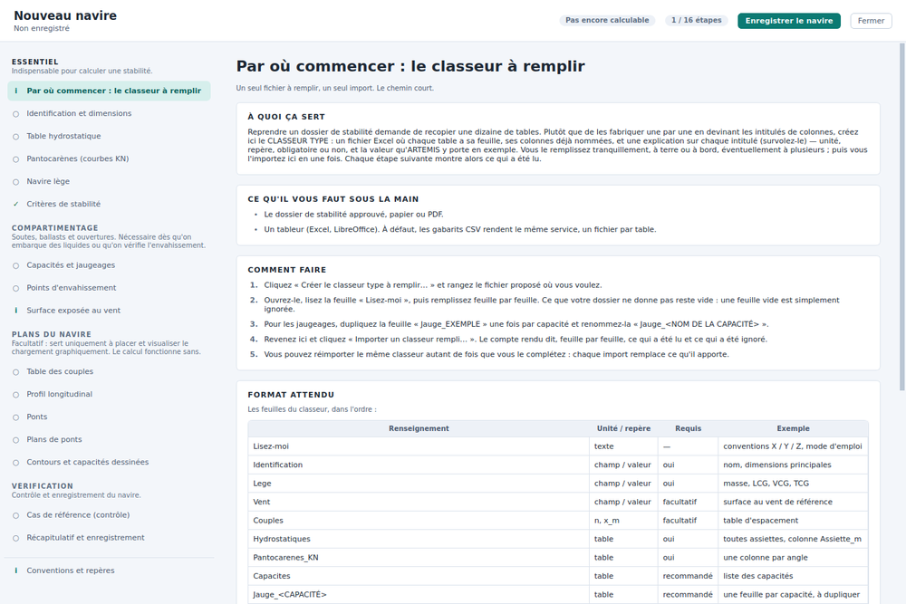
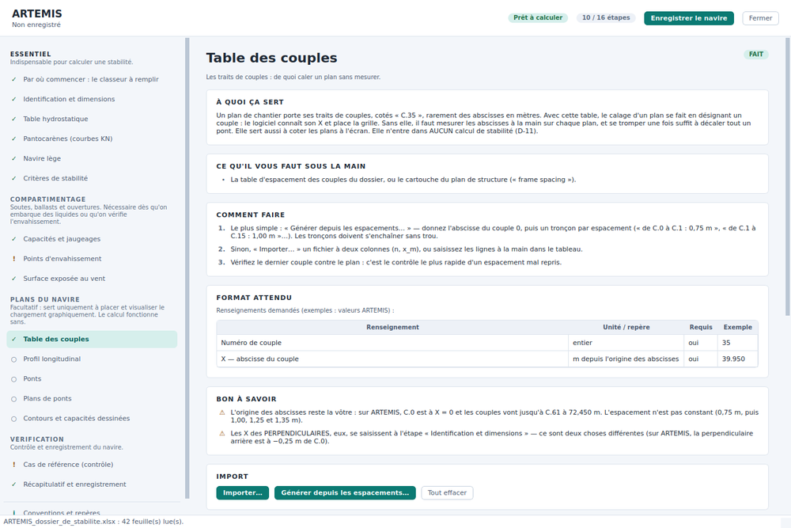
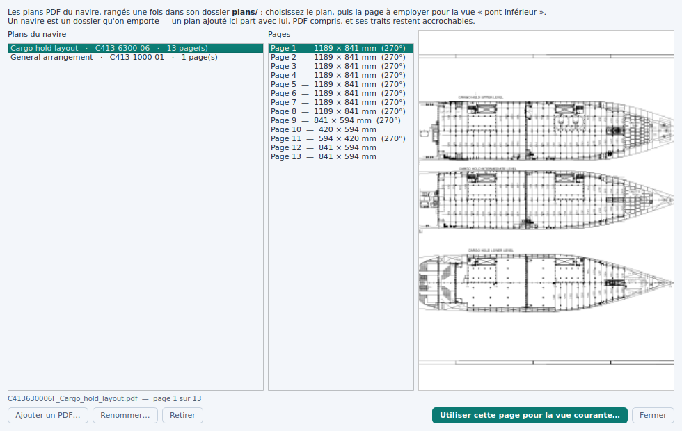
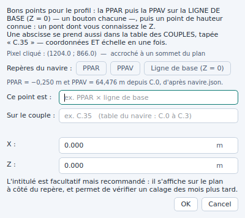
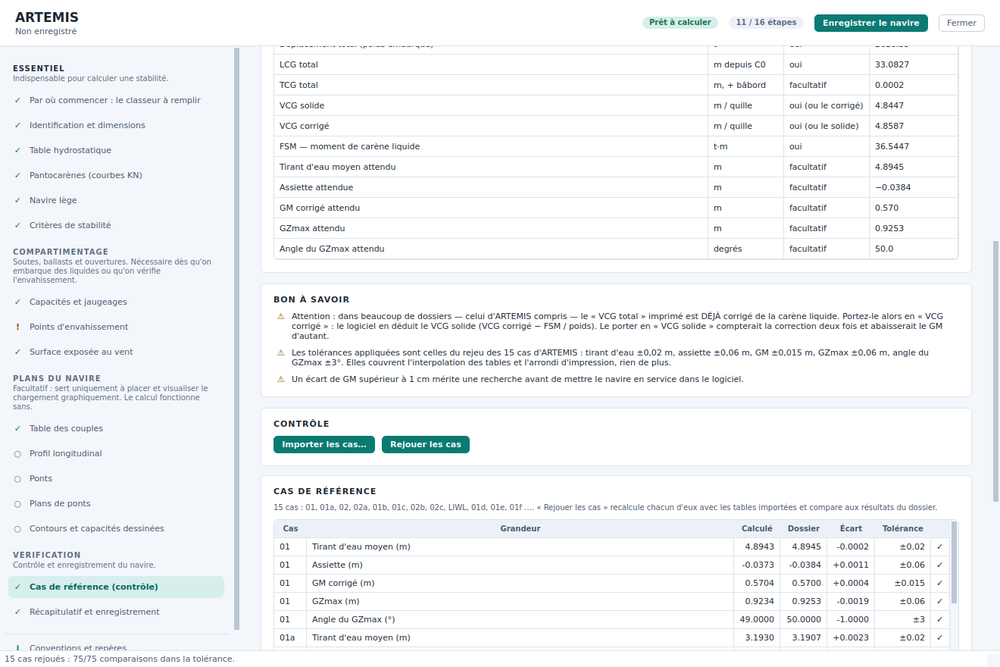

# Recréer le navire depuis un logiciel vierge

Cette page est le parcours complet pour **partir d'une installation de Carène
sans aucun navire et y reconstituer le vôtre** : les tables du dossier de
stabilité dans un classeur à remplir, la table des couples, les plans du
chantier rangés dans un catalogue, le calage sur les perpendiculaires, et le
contrôle final contre les cas du dossier approuvé.

La page [Le navire](navire.md) décrit chaque fenêtre en détail ; celle-ci suit
l'ordre dans lequel on s'en sert.

## Ce qu'il vous faut sous la main

- Le **dossier de stabilité approuvé** (papier ou PDF) : tables
  hydrostatiques, pantocarènes, jaugeages, navire lège, points
  d'envahissement, et une ou deux conditions de chargement avec leurs
  résultats imprimés.
- Le **plan de structure** ou le cartouche qui donne l'**espacement des
  couples**, et les X des perpendiculaires par rapport au couple 0.
- Les **plans du chantier en PDF** : coupe longitudinale, plan des cales, un
  plan par pont. Un PDF vectoriel (sorti d'AutoCAD) vaut mieux qu'un scan :
  le curseur s'y accroche aux traits.
- Un **tableur** (Excel, LibreOffice). À défaut, des gabarits CSV rendent le
  même service.

Comptez une demi-journée pour les tables, autant pour les plans.

## 1. L'installation vierge

Au premier lancement d'une installation sans navire, la fenêtre principale
affiche **« Aucun navire n'est encore défini sur ce poste »** avec deux
boutons : *Créer le navire…* et *Lire d'abord l'aide…*. Le second ouvre
cette page-ci : si vous la lisez depuis là, vous êtes au bon endroit —
préparez ce qui est listé plus haut, puis suivez les étapes dans l'ordre. Le
premier ouvre la fenêtre **Création du navire** — la même que *Navire › Créer
ou modifier le navire…* — sur un brouillon vide.

Le sommaire de gauche liste **seize étapes** en quatre sections : *Essentiel*
(indispensable pour calculer une stabilité), *Compartimentage* (liquides et
envahissement), *Plans du navire* (facultatif : le placement graphique) et
*Vérification*. Chaque étape porte une pastille d'état — ✓ fait, ! à
vérifier, ○ à faire — **déduite de ce qui est réellement renseigné**, jamais
d'une case cochée à la main.

## 2. Par où commencer : le classeur à remplir

C'est la première étape, et le chemin court. Plutôt que de fabriquer un CSV
par table en devinant les intitulés de colonnes, cliquez **Créer le classeur
type à remplir…** : Carène écrit un classeur Excel où **chaque table a sa
feuille**, les colonnes déjà nommées, et **sur chaque intitulé un commentaire
de cellule** — survolez-le dans le tableur — qui donne l'unité, le repère, si
la colonne est obligatoire, et une valeur d'exemple.

| Feuille | Contenu | Requis |
|---|---|---|
| `Lisez-moi` | l'ordre, les conventions X / Y / Z, le mode d'emploi | — |
| `Identification` | nom, dimensions principales, X des perpendiculaires (champ / valeur) | oui |
| `Lege` | masse, LCG, VCG, TCG du navire lège | oui |
| `Vent` | la surface au vent d'une configuration de référence | facultatif |
| `Profils_vent` | la surface au vent par voilure et par tirant d'eau (les cas du dossier) — ce qui rend les critères de vent évaluables | pour les critères de vent |
| `Couples` | `n`, `x_m` — la table d'espacement des couples | pour caler les plans |
| `Hydrostatiques` | toutes les assiettes dans une seule feuille, colonne `Assiette_m` en tête | oui |
| `Pantocarenes_KN` | `Assiette_m`, `Deplacement_t`, puis une colonne par angle (`KN_5`, `KN_10`…) | oui |
| `Capacites` | la liste des soutes et ballasts : nom, contenu, densité, ballast | pour les liquides |
| `Jauge_<NOM>` | une feuille par capacité, à dupliquer depuis `Jauge_EXEMPLE` (`_` vaut espace ou `/`) | pour les liquides |
| `Envahissement` | les ouvertures cotées du dossier | recommandé |
| `Cas_de_reference` | les conditions du dossier et leurs résultats, pour le contrôle final | recommandé |

Remplissez-le à votre rythme, à terre ou à bord, à plusieurs si besoin. **Une
feuille laissée vide n'est pas une erreur** : elle est ignorée et l'étape
correspondante reste « à faire ». Puis **Importer un classeur rempli…** lit
toutes les feuilles en une fois et affiche un **compte rendu feuille par
feuille** — lue, vide, ignorée (nom inconnu) ou en erreur, avec le nombre de
lignes et les colonnes non reconnues. Le sommaire se met à jour dans la
foulée. On peut réimporter le même classeur autant de fois qu'on le complète :
chaque import **remplace** ce qu'il apporte, il ne cumule pas.

**Créer les gabarits CSV…** écrit les mêmes tables en fichiers CSV séparés,
avec un `LISEZ-MOI.md` qui donne, table par table, les colonnes et leur
unité ; chacun s'importe ensuite à son étape.

Pour s'entraîner : si l'installation livre un navire d'exemple, le dossier
`import_<NOM>/` qui l'accompagne contient `<NOM>_dossier_de_stabilite.xlsx`,
le classeur type **rempli avec ce navire**. L'importer dans une installation
vierge redonne, au chiffre près, le navire livré.

## 3. Les tables, étape par étape

Le classeur importé, chaque étape montre ce qu'elle en a tiré, et reste
utilisable seule — un fichier CSV ou Excel par table, colonnes reconnues par
synonymes (`Tirant d'eau moyen (m)`, `Draft`, `TE_milieu_m` désignent la
même grandeur).

- **Identification et dimensions** — le nom devient le nom du dossier ; la
  longueur entre perpendiculaires, la largeur et le creux servent aux critères.
  Renseignez les **X des perpendiculaires** dans le repère de vos tables
  (par exemple : PPAR = −0,250 m et PPAV = 63,200 m depuis C.0) : ce sont eux que
  le calage des plans proposera d'un bouton.
- **Table hydrostatique** — au moins quatre tirants d'eau ; deux assiettes ou
  plus pour interpoler l'assiette d'équilibre.
- **Pantocarènes** — jusqu'à 40° au minimum pour les critères d'aire, 60° de
  préférence.
- **Navire lège** — masse, LCG, VCG, et le TCG s'il est connu. C'est la valeur
  la plus sensible du dossier : 10 cm de VCG déplacent tous les GM de 10 cm.
- **Critères** — IS2008 et météo cochés d'office ; les NR500 se cochent pour un
  voilier.
- **Capacités et jaugeages** — la liste, puis une table par capacité. Le
  contenu, le groupe, la densité et la case *Ballast* se règlent ici une fois
  pour toutes.
- **Points d'envahissement** — seules les ouvertures **cotées** du dossier ;
  gardez la liste des autres quelque part.
- **Surface exposée au vent** — facultatif ; sans elle le critère météo n'est
  simplement pas évalué, et le logiciel le dit.

Le bandeau du haut passe à **« Prêt à calculer »** dès que l'essentiel est
complet.

## 4. La table des couples

Un plan de chantier porte ses traits de couples, cotés « C.35 », rarement des
abscisses en mètres. Avec cette table, **caler un plan se fait en désignant un
couple** : le logiciel connaît son X et pose la grille dessus. Sans elle, il
faut mesurer chaque abscisse à la main sur chaque plan.

Trois façons de la remplir : **Générer depuis les espacements…** — l'abscisse
du couple 0, puis un tronçon par espacement (« de C.0 à C.1 : 0,75 m », « de
C.1 à C.15 : 1,00 m »…), les tronçons devant s'enchaîner sans trou ;
**Importer…** un fichier à deux colonnes `n`, `x_m` ; ou la feuille `Couples`
du classeur. Le tableau se corrige ligne à ligne. Vérifiez le **dernier
couple** contre le plan : c'est le contrôle le plus rapide d'un espacement mal
repris.

Elle n'entre dans **aucun calcul de stabilité** : elle ne sert qu'à caler et à
coter les plans.

## 5. Les plans du chantier

Les étapes *Profil longitudinal*, *Ponts*, *Plans de ponts* et *Contours et
capacités dessinées* ouvrent l'**éditeur de plans** sur la vue choisie. Dans
l'éditeur, l'**assistant** (`F1`) guide les huit temps : nommer, importer le
profil, le caler, définir les ponts, importer et caler chaque plan de pont,
décalquer, poser les calques, enregistrer.

### Le catalogue des plans

*Fichier › Catalogue des plans…* dans l'éditeur, ou **Choisir dans le
catalogue…** dans l'assistant. Les PDF du chantier **entrent une fois** dans le
dossier du navire (`plans/`), avec un titre et leur référence lus dans le nom
du fichier (`C900-6300-06-F Cargo hold layout.pdf` → « Cargo hold layout »,
C900-6300-06) — renommables. Pour chaque plan, la liste des pages avec leur
format, l'aperçu de la page choisie, et **« Utiliser cette page pour la vue
courante… »** qui enchaîne sur le choix de la rotation et de la résolution,
puis rend la page en fond de la vue.

La colonne *Plans du navire* dit pour chaque PDF **quelles vues l'emploient**
(profil, pont Inférieur…) : c'est déduit des vues elles-mêmes, jamais saisi.
Un navire est un dossier qu'on emporte : les PDF du catalogue partent avec lui,
et leurs traits restent accrochables sur un autre poste.

Quand le catalogue n'est pas vide, **Importer le plan…** l'ouvre d'abord ;
**Autre fichier…** ramène à la boîte de fichiers (DXF, image, ou un PDF pas
encore catalogué).

### Caler sur les perpendiculaires

Un calage, ce sont des **coordonnées et une échelle** en une fois : on clique
deux à trois points dont on connaît la position, puis *Appliquer*. À chaque
clic, la fiche du point propose les **repères du navire** d'un bouton :

- sur le **profil** : **PPAR** puis **PPAV**, sur la **ligne de base**
  (Z = 0) — ou deux couples lisibles, **C.0** et **C.60**. Sur un **PDF ou
  un DXF**, ces deux points suffisent ; sur un **scan**, ajoutez un point de
  hauteur connue — un pont. Dans les deux cas, **contrôlez** : la ligne de
  chaque pont, sur la coupe, doit tomber à sa hauteur dans la grille ;
- sur un **plan de pont** : **PPAR** et **PPAV** sur l'axe (Y = 0) — ou les
  couples **C.0** et **C.60**, les deux étiquettes lisibles aux bouts de la
  vue, par le champ *Sur le couple* et **Sur l'axe**. **Sur un PDF ou un DXF,
  ces deux points suffisent** (D-56) : le plan n'a qu'une échelle et ses axes
  sont à l'équerre, et l'accroche pose le curseur pile sur le **croisement
  du trait du couple avec l'axe** — c'est ce croisement qu'il faut cliquer,
  pas le pied du trait : sur un plan des cales, le trait peut traverser
  l'axe sur un mètre de haut, son pied à un demi-mètre sur bâbord.
  Sur une **image scannée**, ajoutez un point **hors axe** dont
  on connaît Y — le bordé à la demi-largeur B/2 au maître-couple —, parce
  qu'un scan peut être étiré différemment dans les deux sens. Rappel : Y
  positif = **bâbord**.

C'est exactement ainsi que les trois ponts du navire d'exemple sont calés,
quand l'installation en livre un : le plan des cales du chantier (page 3) est
dans `plans/`, et chaque pont porte deux points, « Couple C.0 × ligne de foi » et
« Couple C.60 × ligne de foi ». Ouvrez l'éditeur sur l'exemple, *Caler ce
plan* : vous voyez les deux points, et le compte rendu. Les autres couples du
plan tombent sur la table à moins de 2 mm — et le contour de chaque pont,
symétrique en mètres, tombe sur la coque des deux bords : c'est le contrôle
dans l'autre sens, celui qui a manqué à la première version de ce calage
(D-57). Le profil de l'exemple est calé de même sur le plan d'ensemble du chantier
(« SECTION A L'AXE »), par
« Couple C.0 × ligne de base » et « Couple C.60 × ligne de base » ; les
trois ponts, lus sur la coupe, tombent à leur hauteur à 3 mm près.

Les X des perpendiculaires viennent de l'étape *Identification et dimensions* ;
tant qu'ils n'y sont pas, les boutons sont éteints et la fiche le dit. Le champ
**Sur le couple** (« C.35 ») lit la table des couples ; **Ligne de base** et
**Sur l'axe** posent la seconde coordonnée à zéro.

Sur un PDF ou un DXF, le curseur **s'accroche aux sommets des traits** — la
barre d'état affiche « accroche prête » dès qu'ils sont lus ; **Maj** suspend
l'accroche le temps d'un clic. La fiche dit si le point cliqué est accroché
ou libre. Après *Appliquer*, le compte rendu donne l'**écart de chaque point
en centimètres** et l'échelle trouvée ; avec deux points le calage passe
exactement par eux et rien ne le contrôle — regardez la grille des couples
sur le plan, ou ajoutez un troisième point qui dira s'il est juste.

Le décalquage des contours, des cales, des épontilles et des calques est
décrit dans [Le navire](navire.md).

## La cohérence des tables, contrôlée à chaque étape

Une table mal importée ne fait pas d'erreur : elle donne un navire faux qui
calcule. Carène relit donc les tables avec ce que la physique leur impose, à
chaque étape, et le dit — en orange dans l'étape concernée, et en entier
dans l'étape **Contrôle**, sous **Cohérence des tables** :

| Table | Ce qui est vérifié |
|---|---|
| Hydrostatiques | le déplacement croît avec le tirant d'eau ; Δ/V est constant (c'est la densité des tables, qui doit être celle du dossier) ; le TPC suit dΔ/dT ; KB + BM = KM ; TE AR − TE AV = l'assiette ; pas de ligne en double ; le LCB tombe entre les perpendiculaires |
| Pantocarènes | les mêmes angles à toutes les assiettes ; pas de ligne en double ; aux petits angles, KN ≈ KM · sin φ (sinon : KN donnés pour un KG supposé, ou GZ importés comme KN) |
| Jaugeages | le remplissage va de 0 à 100 % (et pas de 0 à 1) ; volume, poids et sonde croissent ; poids/volume ≈ la densité déclarée ; le volume à 100 % ≈ le volume net ; le FSM maximal n'est pas dépassé par la table |

Trois niveaux : **ERREUR** (le navire calculerait faux : reprenez la table),
**À VÉRIFIER** (contre votre dossier), *info* (un écart de données sans
effet sur le calcul). Les seuils sont des tolérances de lecture — une table
imprimée au millième —, pas des règlements. Les tables du navire de référence n'y
produisent que trois informations : la densité des tables (1,025), et deux
écarts d'une fraction de t·m sur le FSM maximal de deux ballasts.

À l'import, un nombre écrit « 1.129,24 » ou « 1,129.24 » se lit 1 129,24, et
« nan » ou « inf » ne passent plus pour des valeurs.

## 6. Le contrôle : les cas de référence

C'est le filet de sécurité de tout ce travail. Dans la feuille
`Cas_de_reference` (ou par **Importer les cas…**), recopiez une ligne par
condition du dossier approuvé : d'abord les **entrées** — poids total, LCG,
TCG, VCG et moment de carène liquide total —, puis les **résultats imprimés**
que vous voulez comparer : tirant d'eau moyen, assiette, GM corrigé, GZmax et
son angle. Ne renseignez que ceux que le dossier donne.

> **VCG corrigé ou VCG solide ?** Dans beaucoup de dossiers — celui du navire de
> référence compris — le « VCG total » imprimé est **déjà corrigé** de la carène liquide.
> Portez-le alors dans la colonne `VCG_corrige_m` : Carène en déduit le VCG
> solide (VCG corrigé − FSM / poids). Le mettre en `VCG_solide_m` compterait la
> correction deux fois et abaisserait le GM d'autant.

**Rejouer les cas** recalcule chaque condition avec les tables importées et
affiche, grandeur par grandeur, le calculé, le dossier, l'écart et la
tolérance — en vert si ça tient, en rouge sinon. Les tolérances sont celles du
rejeu des quinze cas du navire de référence : tirant d'eau ±0,02 m, assiette ±0,06 m, GM
±0,015 m, GZmax ±0,06 m, angle du GZmax ±3°. Elles couvrent l'interpolation
des tables et l'arrondi d'impression, rien de plus : un écart de GM supérieur
au centimètre mérite une recherche avant de mettre le navire en service.

## 7. Enregistrer, puis le reste

**Enregistrer le navire** écrit un navire neuf dans un dossier **à son nom**,
à côté de l'application : `navires/<NOM>/` (« Sœur Océane » →
`SOEUR_OCEANE`). Ce dossier devient le navire de l'installation ; la fenêtre
principale s'ouvre dessus. Un navire déjà enregistré reste où il est.

Restent trois choses qui se font depuis le menu *Navire* de la fenêtre
principale, décrites dans [Le manifeste et le catalogue](manifeste.md) et
[Le point de chargement](point_de_chargement.md) : le **catalogue des
charges** (les types de colis du bord), le **matériel du bord** et les
**escales du navire**.

## Vos dossiers, et les mises à jour de Carène

Une mise à jour de Carène se décompresse **par-dessus** l'installation
précédente. Elle ne contient jamais :

- `navires/<NOM>/` — **votre navire**, avec son journal (`journal/`), ses
  conditions (`conditions/`), ses plans retouchés ;
- `carene.config.json` — les réglages du poste ;
- `journaux/` — le journal technique.

Une installation peut livrer un navire d'exemple, sous
`navires/<NOM>.exemple/`. Carène ne l'ouvre jamais tel quel : au **premier
lancement d'une installation vierge**, elle le copie en `navires/<NOM>/` —
puis ne le regarde plus. Un `navires/<NOM>/` déjà là n'est ni écrasé, ni
« mis à jour ». Si une livraison corrige quelque chose dans le navire
d'exemple, la note de version le dit, et c'est à vous de reporter la
correction — ou de copier le fichier depuis `<NOM>.exemple`.

Pour sauvegarder votre travail, copiez `navires/<NOM>/` ; pour le transporter,
c'est le même dossier. `python main.py --chemins` affiche où Carène cherche le
navire, la configuration et le navire d'exemple.

## Suite

[Le navire](navire.md) — les fenêtres en détail — puis [Réglages et
dépannage](reglages.md).
