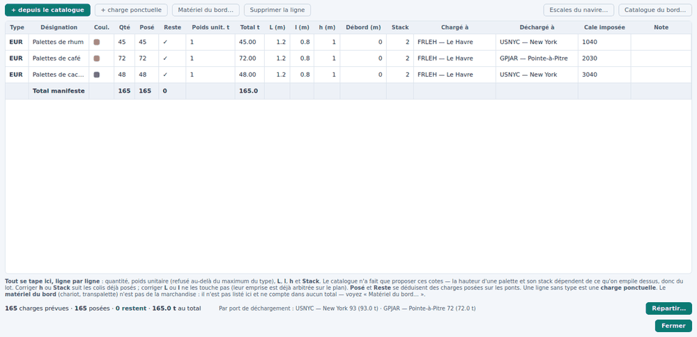

# Le manifeste et le catalogue

Cette page explique comment on déclare ce qu'il y a à embarquer, ce que
signifie chaque colonne du manifeste, et où sont rangés les types de colis du
bord et les engins du navire.

## Trois listes, à ne pas confondre

| Liste | Ce qu'elle contient | Où elle vit |
|---|---|---|
| **Catalogue des charges** | les *types* de colis que le navire charge souvent : palette EUR, palette ISO, fût… | le **navire** |
| **Manifeste** | ce qu'on embarque **ce voyage-ci** : une ligne = un lot = un type × une quantité | le **point de chargement** |
| **Matériel du bord** | les engins qui appartiennent au navire : chariot, transpalette | le **navire** (leur *position*, elle, appartient au point) |

## Le manifeste

Bouton **Manifeste…** de la vue [Chargement](chargement.md), ou le panneau
*Condition de chargement* à gauche de cette vue.

### Ajouter une ligne

- **+ depuis le catalogue** ouvre *Ajouter un lot* : on choisit un type, on
  donne la quantité, et les cotes sont pré-remplies depuis le type.
- **+ charge ponctuelle** crée une ligne sans type : une pièce qui ne servira
  qu'une fois et n'a pas à encombrer le catalogue.
- **Supprimer la ligne** retire la ligne choisie.

Le dialogue *Ajouter un lot* **exige la hauteur** quand le type n'en donne pas,
et annonce l'encombrement dès que le lot déborde (« emprise 1,20 × 0,80 m,
encombrement 1,30 × 0,90 m »).

### Ce que disent les colonnes

| Colonne | Ce que c'est |
|---|---|
| **Type** | le code du type de catalogue, vide pour une charge ponctuelle |
| **Désignation** | le nom du lot, tel qu'il apparaîtra sur le plan et les pointages |
| **Coul.** | la pastille de couleur du lot sur les plans |
| **Qté** | le nombre d'exemplaires **prévus** |
| **Posé** | ceux réellement posés dans les cales, empilement compris |
| **Reste** | Qté − Posé : **orange** tant qu'il reste à embarquer, **coche verte** quand la ligne est complète, **rouge** si l'on a posé plus que prévu |
| **Poids unit. t** | le poids d'un exemplaire — refusé au-delà du poids maximal du type |
| **Total t** | Qté × poids unitaire |
| **L (m)**, **l (m)**, **h (m)** | les cotes du colis : longueur, largeur, hauteur |
| **Débord (m)** | ce qui dépasse de la palette, **de chaque côté** |
| **Stack** | le nombre d'exemplaires empilables |
| **Chargé à** / **Déchargé à** | les escales du navire — voir [Les escales](point_de_chargement.md) |
| **Cale imposée** | le code de la cale où ce lot doit aller, s'il y en a une |
| **IMDG** | la classe IMDG d'une marchandise dangereuse (3, 9, 2.1…) ; vide pour une marchandise ordinaire. Elle suit les colis déjà posés, et le lot n'entre que dans une cale qui admet sa classe |
| **Note** | texte libre |

**Tout se tape, ligne par ligne.** Le catalogue n'a fait que *proposer* ces
cotes : la hauteur, le débord et le stack dépendent de ce qu'on empile sur la
palette, pas de la palette.

### Corriger une ligne dont des colis sont déjà posés

| Ce qu'on corrige | Ce qui arrive aux colis déjà posés |
|---|---|
| **h**, **Débord**, **Stack** | ils suivent. Aucun ne touche l'emprise au sol, donc rien ne se déplace — le débord peut en revanche faire **apparaître des défauts**, et c'est ce qu'on veut voir |
| **Poids unit. t** | ils suivent : une palette pesée au quai à 2,4 t au lieu de 1,6 t pèse 2,4 t dans la cale aussi. La barre d'état dit combien de colis ont suivi et ce que cela change à bord, en tonnes |
| **L** ou **l** | ils ne bougent pas. Changer une emprise sous un colis arrimé fabriquerait des chevauchements sans passer par la porte qui les refuse : on **retire et on repose** |

### Deux lignes du même type

C'est permis : deux lots, deux destinataires, deux cales imposées. Elles sont
alors **servies dans l'ordre**, chacune jusqu'à sa quantité ; l'excédent
éventuel apparaît sur la dernière ligne du type, en rouge.

### Le pied du tableau

La ligne d'état totalise : « 165 charges prévues · 165 posées · 0 restent ·
165.0 t au total », puis le détail **par port de déchargement**. Le bouton
**Répartir…** lance le [répartiteur](repartiteur.md) sans quitter le manifeste.

## Le débord — et ce qu'il ne faut pas confondre avec lui

Le **débord** est une cote de la **marchandise** : des palettes de sacs de café
ne sont pas au carré et dépassent de quelques centimètres. 0,05 m = 5 cm tout
autour ; une palette de 1,20 × 0,80 occupe alors 1,30 × 0,90.

- Le colis occupe son **encombrement** (emprise + 2 × débord), dessiné en
  **pointillé** autour de lui sur tous les plans.
- L'encombrement décide de toute la **place** : chevauchement entre colis,
  contour de cale, épontilles, zones interdites, calepinage, aimantation.
  Deux encombrements qui se recouvrent sont **refusés**, et le motif le dit
  (« débords compris »).
- La **charge au m²**, elle, se calcule sur l'**emprise nominale** : le poids
  descend par les pieds de la palette. Compter les sacs qui débordent ferait
  baisser la pression annoncée, donc rendrait le contrôle moins sévère qu'il
  ne doit l'être.

> **À ne pas confondre avec le jeu d'arrimage** de la barre du plan de
> chargement, qui est un réglage de *travail* (l'espace qu'on laisse
> volontairement entre deux colis) et qui ne **refuse jamais** une pose. Voir
> [Charger à la main](chargement.md).

## Le catalogue des charges

*Navire › Catalogue des charges…* (`Ctrl+K`), ou le bouton **Catalogue du
bord…** du manifeste.

Le catalogue garde les types de colis du bord : palettes Europe, ISO,
demi-palettes, mais aussi tout colis aux dimensions particulières. Chaque type
porte :

- **L (m)**, **l (m)** et **h (m)** dans leur colonne propre ;
- son **poids** et son poids maximal ;
- son **stack** — le nombre d'exemplaires empilables ;
- son **débord** proposé ;
- si la **rotation** est permise ;
- sa **couleur** sur les plans ;
- une colonne **Origine**, qui dit d'où viennent les chiffres (« manuel
  d'assujettissement § 3 ») et s'écrit à la main.

### Ce catalogue est le vôtre

**Rien n'y est verrouillé.** Celui livré avec le navire de référence vient du
manuel d'assujettissement, mais c'est une **démonstration** : chaque type s'y
modifie et s'y retire, dimensions, poids maximal et stack compris. La colonne
*Origine* est une information, pas une serrure.

Deux choses seulement restent refusées, pour une raison physique : une
**dimension nulle**, et un **poids au-delà du poids maximal** du type.

**Le code aussi se corrige**, sur n'importe quel type — un clic dans la
colonne *Code*. Un code déjà pris par un autre type est refusé. Quand un code
change, **le manifeste et les colis posés du point ouvert suivent** (et ses
brouillons), la barre d'état dit combien ; les points **archivés** gardent
l'ancien code, avec leurs propres dimensions — un manifeste porte les siennes,
le type ne fait que les proposer.

### La hauteur est facultative au catalogue

La longueur et la largeur d'une palette sont données à sa construction ; sa
hauteur, non — elle dépend de ce qu'on empile dessus. Un type sans hauteur
s'affiche « — » et ne bloque rien au catalogue, mais **on ne peut pas en faire
un lot sans la donner** : elle sert au contrôle de hauteur libre et au centre
de gravité, et un zéro passerait sous tous les contrôles.

## Le matériel du bord

*Navire › Matériel du bord…*, ou le bouton **Matériel du bord…** du manifeste
ou de la vue Chargement.

C'est l'inventaire des engins qui appartiennent au **navire** et servent au
chargement — chariot élévateur, transpalette. Ils **pèsent et occupent la
place**, mais ce n'est pas de la marchandise : ils ne figurent à aucun
manifeste et n'entrent dans aucun total de cargaison.

Le tableau donne **L (m)**, **l (m)**, **h (m)**, le poids, la **quantité** et
le **stack**, tous éditables.

- La **quantité**, parce qu'un armement a rarement un seul transpalette : les N
  exemplaires se posent **un par clic** sur le plan, en prenant l'engin dans le
  groupe « Matériel du bord » du sélecteur de lots, exactement comme un lot.
- Le sélecteur dit ce qu'il reste à arrimer ; le poids **à bord** compte tous
  les exemplaires, le poids **arrimé** ceux qui ont trouvé leur place.
- Deux engins qui n'ont pas la même prescription d'arrimage restent **deux
  fiches** : le manuel du bord peut prescrire un chariot en cale avant et un en
  cale arrière, et les fusionner effacerait une donnée du navire.

Dans le bilan des poids de la vue [Stabilité](stabilite.md), « MATÉRIEL DU
BORD » est un groupe à part.

## Suite

[Charger à la main](chargement.md) — poser tout cela dans les cales.
