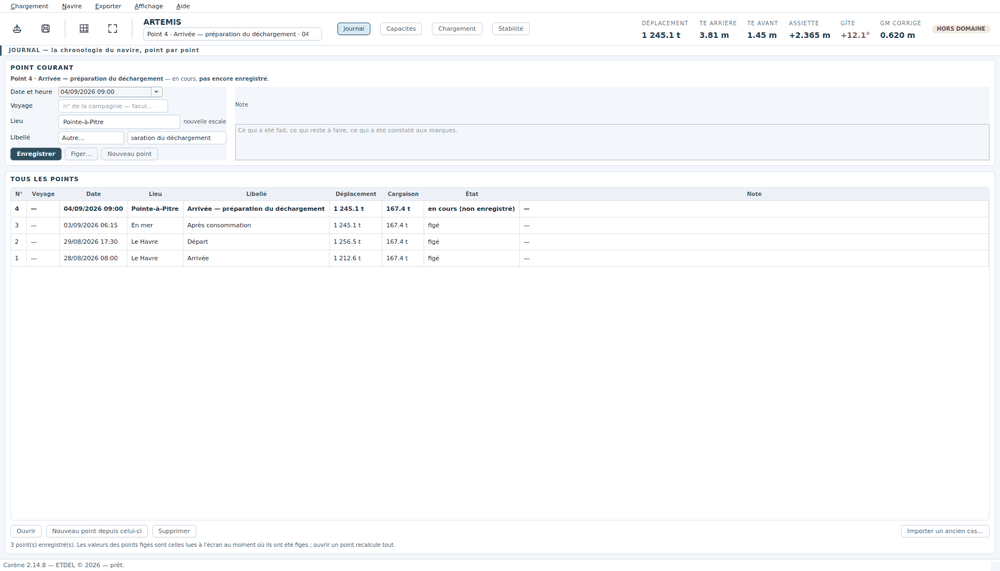

# Le point de chargement

Cette page explique l'unité de travail de Carène — le **point** — et comment
on l'ouvre, l'enregistre et l'archive dans le journal du navire.

## Ce qu'est un point

Un point, c'est **l'état du navire à un instant donné** : le relevé de toutes
les capacités, la cargaison posée dans les cales, les poids divers, et le
calcul qui en découle. Un point porte une date, un lieu, un libellé (« Arrivée »,
« Départ », « Après consommation »…) et, si la compagnie en donne un, un numéro
de voyage.

Le navire ne tient donc pas une collection de « cas de chargement » séparés,
mais une **chronologie** : le point 4 est la suite du point 3, et s'ouvre comme
une copie de celui-ci qu'on corrige.

## Le principe du journal, en cinq lignes

1. **On travaille toujours sur un point** — celui que nomme la liste
   déroulante du bandeau, sous le nom du navire. Tout ce qu'on saisit
   (sondes, cargaison, poids divers) va dans ce point-là.
2. **Un nouveau point est une copie du courant.** À chaque escale, à chaque
   relevé en mer, on ouvre le suivant (`Ctrl+N`) et on corrige ce qui a
   changé : on ne repart jamais de zéro.
3. **Enregistrer** (`Ctrl+S`) écrit le point sur le disque ; un point
   enregistré reste modifiable.
4. **Figer** archive un point pour de bon, verdict compris : c'est ce qu'on
   fait au départ, pour dire dans quel état le navire a appareillé.
5. **Changer de point demande confirmation** — on risque trop de modifier un
   point en croyant travailler sur un autre. La question dit quel point on
   quitte et lequel on ouvre.

Le journal a **son menu** dans la barre du haut : *Journal › Voir le journal*
(`F2`) ouvre la vue ; *Ouvrir le point ▸* liste tous les points, le courant
coché ; *Nouveau point*, *Enregistrer*, *Figer* et *Importer un ancien cas*
y sont aussi. Le bouton *Journal* n'est plus dans la rangée des vues : la vue
Journal est là où l'on **choisit** sur quoi travailler, pas une vue du travail.

## La vue Journal

*Journal › Voir le journal* (`F2`, ou `Ctrl+J` pour les doigts qui l'ont
appris).

La vue se lit en deux blocs :

- **POINT COURANT** — la fiche du point sur lequel vous travaillez : **date
  du point**, voyage, lieu, libellé, note, et **modifié le**. C'est ici qu'on
  décrit le point ; le contenu (liquides, cargaison) se saisit dans les autres
  vues.
- **TOUS LES POINTS** — la chronologie, un point par ligne, le plus récent en
  haut : N°, Voyage, Date du point, Lieu, Libellé, Déplacement, Cargaison,
  État, Modifié le, Note.

### Les deux dates

Un point porte **deux dates**, et il ne faut pas les confondre :

- la **date du point** — celle de l'événement qu'il décrit : le départ,
  l'arrivée, le relevé en mer. C'est vous qui la donnez (proposée = maintenant
  à la création, modifiable dans la fiche) ;
- **modifié le** — la date et l'heure du **dernier enregistrement**, posée
  par Carène, jamais saisie. Un point d'avant cette version l'affiche « — »
  jusqu'à son prochain enregistrement.

## Les gestes

### Choisir le point sur lequel on travaille

La liste déroulante du bandeau, à côté du nom du navire, porte tous les
points du journal, et finit par **＋ Nouveau point (copie du courant)…**.
*Journal › Ouvrir le point ▸* liste les mêmes points, le courant coché. Dans
la vue *Journal*, sélectionner une ligne puis **Ouvrir** fait la même chose.

**Changer de point demande confirmation** : « Quitter « Point 3 » pour ouvrir
« Point 2 » ? Capacités, chargement et verdict affichés seront ceux de l'autre
point. » Puis, si le point qu'on quitte a des modifications non enregistrées,
Carène propose de les enregistrer. Ouvrir un point relance tout le calcul.

Au **lancement**, Carène demande sur quel point travailler : la boîte montre
pour chaque point le n°, le voyage, la **date du point**, le lieu, le libellé,
la **note** (le texte complet en infobulle), le nombre de colis posés, l'état
et la date de modification — ce qui sert à reconnaître un point. Déplacement,
GM et verdict sont dans l'infobulle de la colonne État. Le point en cours est
en tête, présélectionné.

### Créer le point suivant

*Journal › Nouveau point (copie du courant)* (`Ctrl+N`), ou **＋ Nouveau
point…** au bout de la liste déroulante du bandeau, ou le bouton **Nouveau
point** de la fiche, ou **Nouveau point depuis celui-ci** sous la
chronologie. Carène demande confirmation : un point de plus dans le journal
n'est pas rien.

Le nouveau point est une **copie intégrale** du courant : mêmes sondes, même
cargaison. C'est ce qu'on veut au départ d'une escale — on part de ce qu'on a
et on corrige ce qui change.

1. Réglez la date et l'heure.
2. Choisissez le **Lieu** : la liste propose les escales du navire, et
   « nouvelle escale » ouvre la recherche mondiale.
3. Choisissez le **Libellé** dans le menu (« Arrivée », « Départ »…), ou
   *Autre…* pour un intitulé libre.
4. Saisissez le voyage et la note si besoin.

### Enregistrer

*Journal › Enregistrer le point* (`Ctrl+S`), ou le bouton **Enregistrer** de
l'en-tête.

Tant qu'un point n'est pas enregistré, la fiche et la chronologie le disent
(« en cours, non enregistré »). Un point enregistré reste **modifiable** :
on l'ouvre, on corrige, on ré-enregistre.

### Figer

*Journal › Figer ce point…* (`Ctrl+Shift+S`), ou le bouton **Figer…**.

Figer archive **l'état du navire à cet instant, verdict compris** : les
chiffres du point figé sont ceux qui étaient à l'écran au moment où on l'a
figé, et ils ne bougent plus, même si le dossier du navire change ensuite.
C'est ce qu'on fige au départ pour dire « voilà dans quel état le navire a
appareillé ».

> **C'est définitif.** Un point figé ne se remodifie pas. Pour repartir de là,
> créez un nouveau point depuis celui-ci.

### Un point ne se perd pas

Chaque point s'écrit **de façon protégée** : dans un fichier provisoire
d'abord, puis mis en place d'un seul geste, la version précédente gardée à
côté en `.bak`. Une coupure de courant ou un réseau perdu pendant
l'enregistrement laisse donc le point tel qu'il était avant — jamais à
moitié écrit. Si un point écrit par une version d'avant est abîmé, Carène le
relit dans sa copie `.bak` et le dit à l'ouverture ; s'il n'en a pas, elle
le nomme. Réenregistrez un point restauré : son fichier est réparé.

Ce qui modifie le chargement — le répartiteur, le ballastage, le relevé de
tirants d'eau — marque le point **modifié** : fermer ou changer de point
propose alors de l'enregistrer. Réenregistrer le navire (*Créer ou modifier
le navire…*) garde le point en cours et ses modifications.

**Un point figé ne se modifie par aucun chemin** : ni la case *Navire lège
inclus*, ni *Retirer le poids fictif*, ni F7, F8, F9. Carène le dit, et
propose Ctrl+N.

### Supprimer, importer

**Supprimer**, sous la chronologie, retire le point choisi du journal : il
part dans la **corbeille du journal** (`journal\.supprimes\` dans le dossier
du navire), d'où il se récupère à la main en le remettant dans `journal\`.
Un poste en lecture seule ne supprime rien.

*Journal › Importer un ancien cas de chargement…* reprend un fichier de cas
enregistré avec une version précédente de Carène et en fait un point du
journal. Le bouton **Importer un ancien cas…** de la vue *Journal* fait la même
chose.

### Fermer Carène

*Chargement › Quitter*, ou la croix de la fenêtre. Carène **demande toujours
confirmation** : « Fermer Carène ? » avec le nom du point et son état.
Point enregistré : *Quitter* ou *Annuler*. Point modifié depuis le dernier
enregistrement : *Enregistrer et quitter*, *Quitter sans enregistrer*, ou
*Annuler*. Le bouton par défaut est *Annuler* — Entrée ou Échap sur une
question qu'on n'a pas lue ne ferme rien.

### Une seule fenêtre de Carène à la fois

Deux Carène ouverts sur le même poste écriraient dans le même journal, chacun
sans voir l'autre. Un second lancement **ramène la fenêtre déjà ouverte au
premier plan** et se retire, en le disant. Le verrou (`carene.verrou`, à côté
de la configuration) tombe tout seul à la fermeture, même après un plantage :
c'est le processus qui le tient, pas un chronomètre.

## Les escales

*Navire › Escales du navire…* tient la liste des ports de la ligne, dans
**l'ordre du voyage**. Chaque escale porte son code UN/LOCODE et son nom ; on
la cherche dans les 17 573 ports du monde, ou on la tape.

Cette liste sert à trois choses :

1. proposer le **Lieu** d'un point sans le retaper ;
2. remplir les colonnes **Chargé à** et **Déchargé à** du
   [manifeste](manifeste.md) ;
3. donner au [répartiteur](repartiteur.md) l'**ordre des escales**, dont il se
   sert pour ne rien empiler sur ce qui se débarque avant.

Sans liste d'escales, rien ne casse : le répartiteur se tait plutôt que
d'inventer un ordre de voyage.

## À savoir

- Les points vivent dans le dossier du navire, sous `journal/`. Ils partent
  avec lui si on copie le dossier sur un autre poste.
- Les valeurs affichées pour un point **figé** sont son instantané ; ouvrir un
  point non figé **recalcule tout** à partir des tables actuelles.
- Le déplacement et la cargaison de la chronologie permettent de comparer deux
  escales d'un coup d'œil.

## Suite

[Les capacités : soutes et ballasts](capacites.md) — le premier relevé d'une
arrivée.
