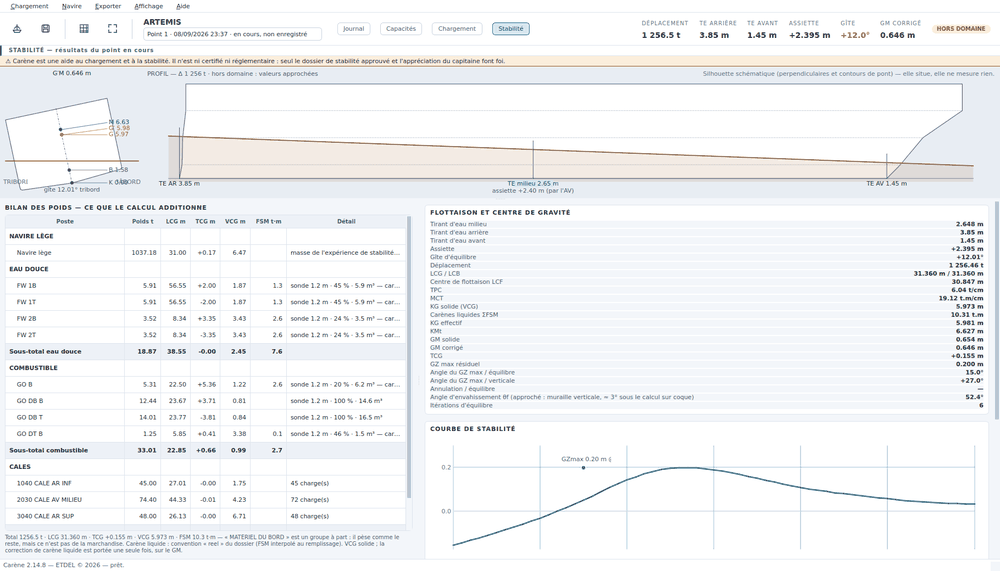
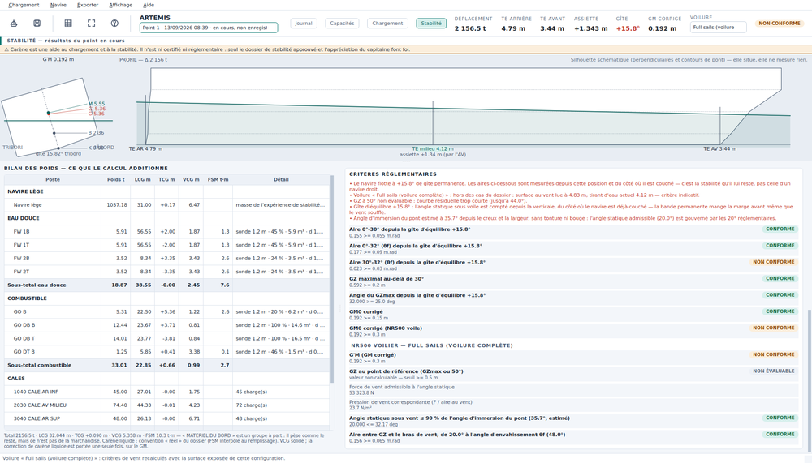

# La stabilité

Cette page explique comment lire la vue des résultats : les tirants d'eau,
l'assiette, la gîte, le GM, la courbe GZ et les critères — et ce que veut dire
un chiffre annoncé comme « approché » ou « hors domaine ».

## La barre de la vue Stabilité

Sous le titre de la vue, une barre réunit **tout ce qui touche au dossier de
stabilité**, rangé en quatre groupes — comme la barre de la vue Chargement :

| Groupe | Ce qu'on y trouve |
|---|---|
| **RELEVÉ** | *Tirants d'eau relevés…* (`F7`, voir plus bas) ; à côté, le **poids fictif** en place s'il y en a un (« poids fictif +12,3 t à x = 34,20 m »), et le bouton *Retirer le poids fictif* — `Ctrl+Z` le remet |
| **CALCUL** | la case *Navire lège inclus* (la même donnée que dans le récapitulatif de la vue Chargement : décochée, on ne regarde que ce qui est embarqué — jamais pour un verdict), *Recalculer* (`Ctrl+R`), *Ballastage…* (`F8`) |
| **DOSSIER** | *Exporter ou imprimer…* (`Ctrl+E`) : le rapport de stabilité et les autres documents, à prévisualiser, imprimer ou exporter — voir [Les exports](exports.md) |
| **ÉTAT** | le compte des **critères tenus** sur ceux du dossier, pour la voilure choisie (« 8 / 9 critères tenus », en orange dès qu'un manque, avec le nombre de critères non évaluables) ; le détail est dans le tableau des critères |

Sur une fenêtre étroite, les groupes passent à la ligne : rien ne disparaît.

## Ouvrir la vue

*Affichage › Stabilité* (`F5`), ou le bouton **Stabilité** du bandeau.

La bande d'avertissement en tête rappelle en permanence ce qu'est ce calcul :
une aide, ni certifiée ni réglementaire.

## Le haut de la vue

À gauche, la **coupe** : le navire vu de l'arrière, incliné de sa gîte
d'équilibre, avec les points K, B, G et M cotés. C'est la lecture d'un coup
d'œil du bras de levier initial.

À droite, le **PROFIL** : la flottaison sur la silhouette du navire, avec
`TE AR`, `TE milieu`, `TE AV` et l'assiette. Tant qu'aucun plan n'est calé, la
silhouette est **schématique** — reconstituée à partir des tables du dossier.
La mention « elle situe, elle ne mesure rien » le dit : elle est cohérente avec
la carène, mais ce n'est pas un plan des formes.

## BILAN DES POIDS — ce que le calcul additionne

Le tableau de gauche montre, poste par poste, ce qui compose le déplacement :

| Poste | Ce qu'il regroupe |
|---|---|
| **NAVIRE LÈGE** | la masse de l'expérience de stabilité et ses centres, lus dans le dossier |
| **EAU DOUCE**, **COMBUSTIBLE**, **BALLAST**, **HUILES**… | les capacités, une ligne par capacité relevée, avec sous-total de groupe |
| **CALES** | une ligne par cale, avec le nombre de charges posées |
| **MATÉRIEL DU BORD** | les engins du navire — un groupe à part : ils pèsent, mais ce n'est pas de la marchandise |
| **POIDS DIVERS** | ce qu'on ajoute à la main (équipage, vivres, une pièce hors manifeste) |

Chaque ligne porte **Poids t**, **LCG m**, **TCG m**, **VCG m**, **FSM t·m**,
et un **Détail** qui dit d'où vient le chiffre (« sonde 1.2 m · 45 % ·
5.9 m³ », « 45 charge(s) »).

La ligne du bas totalise, et rappelle la **convention de carène liquide** du
dossier. Le VCG affiché est le **VCG solide** : la correction de carène liquide
est portée **une seule fois**, sur le GM.

## FLOTTAISON ET CENTRE DE GRAVITÉ

C'est le détail que le bandeau ne porte pas.

| Ligne | Ce que c'est |
|---|---|
| **Tirant d'eau milieu / arrière / avant** | lus dans la table hydrostatique, aux perpendiculaires |
| **Assiette** | positif = enfoncement arrière |
| **Gîte d'équilibre** | l'angle où le navire se pose de lui-même |
| **Déplacement** | le poids total |
| **LCG / LCB** | centre de gravité et centre de carène longitudinaux — égaux à l'équilibre |
| **Centre de flottaison LCF** | l'abscisse autour de laquelle le navire pivote quand on ajoute un poids |
| **TPC** | tonnes par centimètre d'immersion |
| **MCT** | moment pour un centimètre d'assiette |
| **KG solide (VCG)** | le centre de gravité réel, sans correction |
| **Carènes liquides ΣFSM** | la somme des moments de surface libre |
| **KG effectif** | KG solide relevé de ΣFSM / déplacement |
| **KMt** | hauteur du métacentre transversal |
| **GM solide** | KMt − KG solide |
| **GM corrigé** | KMt − KG effectif — **c'est le chiffre du bandeau** |
| **TCG** | centre de gravité transversal : c'est lui qui couche le navire |
| **GZ max résiduel** | le plus grand bras de levier restant depuis la gîte d'équilibre |
| **Angle du GZ max / équilibre** et **/ verticale** | le même angle, compté depuis la gîte puis depuis la verticale |
| **Annulation / équilibre** | l'angle où le GZ résiduel s'annule, ou « — » s'il n'est pas atteint dans le domaine tabulé |
| **Angle d'envahissement θf** | l'angle où la première ouverture non étanche entre dans l'eau |
| **Itérations d'équilibre** | combien de passes le calcul a demandées |

## Les tirants d'eau relevés : la coque contre le calcul

*Chargement › Tirants d'eau relevés…* (`F7`).

Le calcul dit ce que **le chargement déclaré** pèse. La coque, elle, dit ce
qu'elle porte vraiment. Entre les deux, il y a toujours quelque chose : une
citerne qu'on croyait vide, des colis embarqués sans manifeste, de l'eau dans
un fond de cale. Cette fenêtre met les deux face à face et **chiffre l'écart
comme un poids fictif** — une masse, et une position.

**Ce qu'on saisit** : le tirant d'eau arrière et le tirant d'eau avant, **lus
aux repères peints** (Carène rappelle lesquels, d'après le dossier). La
fenêtre s'ouvre sur les tirants d'eau *calculés* : on corrige ce qu'on lit
vraiment. Trois cases facultatives : le **tirant d'eau au milieu** (il ne
change aucun calcul, mais il mesure la flèche de la coque et Carène la
signale), la **densité de l'eau du port** (un port saumâtre à 1,010 change le
déplacement de 1,5 %), et **valeurs déjà ramenées aux perpendiculaires** si
votre relevé est déjà corrigé.

**Un bord ou les deux.** Un seul bord suffit, navire droit : c'est le cas
par défaut, et Carène le rappelle. Si le navire gîte au moment du relevé,
cochez **Relevé des deux bords** : les premières valeurs deviennent celles de
bâbord, une seconde rangée prend tribord, et le calcul retient la **moyenne**
des deux bords — elle efface l'effet de la gîte. Carène dit alors la gîte
apparente (l'écart tribord − bâbord rapporté à la largeur). Le rapport
imprime les deux lectures.

**Ce que Carène en fait**, dans cet ordre : elle ramène les lectures aux
perpendiculaires (les repères sont peints ailleurs — par exemple à 1,75 m et
60,00 m du couple 0 contre −0,25 m et 63,20 m : les confondre fausse
l'assiette de 9 %), elle lit la table hydrostatique à cette assiette et à ce
tirant d'eau, elle corrige de la densité, puis elle compare au chargement
déclaré. L'écart sort en deux nombres : **combien** (Δ observé − Δ déclaré) et
**où** (l'abscisse qui fait concorder les moments), avec le couple le plus
proche et la cale au droit de laquelle il tombe.

**Ce qu'elle refuse d'inventer.** Des tirants d'eau donnent une masse et une
abscisse ; jamais une hauteur — le KG ne se lit pas sur la coque, il se mesure
à l'expérience de stabilité. Le poids fictif est donc posé **au KG et au TCG
du point** : le déplacement et l'assiette rejoignent la coque, le KG et la
gîte ne bougent pas. Si vous savez où est vraiment le poids manquant,
modifiez-le dans les poids divers comme n'importe quel autre.

**Les valeurs étranges**, dites en toutes lettres :

- la position tombe **hors du navire** : ce n'est pas un poids oublié, c'est
  une lecture ou un poids déclaré qui cloche ;
- une **masse quasi nulle mais un moment** : rien ne manque, quelque chose est
  mal placé — et aucune position ne peut être calculée ;
- un écart de **plus de 5 % du déplacement** : une citerne entière, une
  densité fausse ou une lecture d'un mètre ;
- le relevé tombe **hors du domaine des tables** ;
- une **densité** hors de 0,995–1,035 ;
- une **flèche au milieu** de plus de 5 cm : tonture ou contre-tonture, que
  des tables à deux entrées ne corrigent pas.

**Rien n'est appliqué sans vous.** *Ajouter ce poids fictif* le pose dans les
poids divers du point sous un nom qui dit d'où il vient (« Écart aux tirants
d'eau relevés du 22/09/2026 (AR 4,75 / AV 2,94 m aux PP) ») ; il s'efface
comme n'importe quel poids, et un second relevé remplace le premier au lieu de
s'y ajouter. Le relevé reste attaché au point : il se rouvre tel qu'il a été
saisi, et le **rapport de stabilité** l'imprime avec l'écart — corrigé ou non.

## COURBE DE STABILITÉ

La courbe GZ, calculée sur les pantocarènes du dossier. Le `GZmax` y est
repéré.

### L'origine des critères : la stabilité **résiduelle**

Les aires réglementaires, le GZmax et l'angle d'annulation se mesurent **depuis
la gîte d'équilibre, et du côté vers lequel le navire est déjà couché**. C'est
la stabilité qu'il lui *reste*.

Sur un navire droit, l'origine vaut 0° et les chiffres sont ceux qu'on attend.
Sur un navire gîté, l'écart est considérable — et c'est le bon chiffre :
mesurer les aires depuis la verticale, du côté positif quel que soit le sens de
la bande, rendrait deux cas rigoureusement symétriques différents.

Trois conséquences pratiques :

- la courbe résiduelle est **recalculée sur les pantocarènes**, pas
  rééchantillonnée sur la courbe tracée ;
- elle **s'arrête au dernier angle tabulé**. Avec une forte bande, elle peut ne
  plus atteindre 40°, et l'aire correspondante est alors déclarée **non
  évaluable** plutôt que prolongée ;
- l'**angle d'envahissement θf** plafonne les aires : l'aire dite « 0-40° »
  s'arrête à θf s'il est inférieur. Le libellé du critère indique la borne
  réellement utilisée.

## CRITÈRES RÉGLEMENTAIRES

Une ligne par critère, avec son libellé, la valeur obtenue, le seuil, et une
pastille :

| Pastille | Ce qu'elle veut dire |
|---|---|
| **CONFORME** | le critère est satisfait |
| **NON CONFORME** | il ne l'est pas |
| **NON ÉVALUABLE** | le calcul n'a pas pu être mené jusqu'au bout — courbe qui ne va pas assez loin, donnée absente. **Ce n'est pas « non conforme »**, et ce n'est surtout pas « conforme » |
| *information* | une valeur que le dossier imprime sans seuil (bras de vent, période de roulis, facteurs du critère météo…) : elle ne pèse pas dans le verdict |

Les critères viennent des **réglementations retenues par le navire**
(bibliothèque de Carène, étape *Critères* de la création du navire — voir
[Le navire](navire.md)) : rien n'est codé dans le logiciel. Une
réglementation qui n'a pas été rejouée sur un dossier approuvé (*relue* ou
*à relire*) porte son propre titre dans le tableau, et les réserves le
rappellent. Le rapport de stabilité liste en section 8 chaque
réglementation appliquée, avec son texte, sa version et son statut.

**Le verdict du point**, au bandeau et au rapport, est l'un de quatre mots :

| Verdict | Ce qu'il veut dire |
|---|---|
| **CONFORME** | tous les critères ont été évalués, et tous passent |
| **NON CONFORME** | au moins un critère évalué échoue |
| **INCOMPLET** | tout ce qui a pu être évalué passe, mais un critère n'a pas pu l'être — un critère météo retenu pour ce navire sans surface au vent au dossier, par exemple. **Ce n'est pas « conforme »** |
| **NON ÉVALUABLE** | aucun critère n'a pu être produit |

**Un navire qui ne se redresse pas** (aucun équilibre stable) ou **qui ne
tient pas le vent établi** (le bras de vent n'est jamais rattrapé par GZ)
n'est pas « non évaluable » : c'est le pire des cas, et il est **NON
CONFORME**, chiffres à l'appui.

### La ligne de charge

Si le dossier donne le **tirant d'eau d'été** du certificat de franc-bord
(*Créer ou modifier le navire… › Identification et dimensions*), une ligne
*Tirant d'eau milieu ≤ tirant d'eau d'été* rejoint les critères, sous le
titre *Ligne de charge*. Sans lui, les réserves disent que la ligne de
charge n'est pas contrôlée — on n'invente pas une marque. Le détail de la
flottaison donne aussi le **port en lourd** : le déplacement moins le navire
lège.

### Le critère météo en chiffres

Le tableau porte tout ce qu'il faut pour refaire le calcul à la main, comme
le recueil : les bras de vent lw1 et lw2, les angles θ0, θ1 et θ2, la période
de roulis, les facteurs r, X1, X2, k et s, le bras Z. Les aires **a** et
**b** sont bornées par le bras de rafale lw2, comme dans le texte du Code IS.
La gîte sous vent établi est bornée à **16°, ou à 80 % de l'angle
d'immersion du livet** s'il est plus petit. La longueur à la flottaison est
celle de la table si elle la porte ; sinon la longueur de franc-bord la
remplace, et c'est dit.

## La voilure et les critères de vent

Le dossier du navire de référence calcule ses conditions en **configuration cargo**
(voiles enroulées), en **full sails**, **intermediate sails** et **reduced
sails**. Carène aussi : le sélecteur **VOILURE** du bandeau, à côté du
verdict, porte la voilure du point de chargement (elle est enregistrée avec
lui). Elle décide du critère de vent appliqué, et donc du verdict :

- **voiles enroulées** — le navire est un cargo au vent de travers : critère
  **météo IS2008 §2.3** (bras de vent de 504 Pa, roulis au vent, aire *b* ≥
  aire *a*, gîte sous vent stable ≤ 16°) ;
- **toile dehors** — le critère **NR500 voilier** (« Sailing Yachts »), celui
  que le recueil du bord imprime pour ses cas *d/e/f* : G'M ≥ 0,30 m ; GZ à
  50° (ou GZmax si son angle dépasse 50°) ≥ 0,50 m ; angle statique sous vent
  ≤ 20° et ≤ 90 % de l'angle d'immersion du pont ; aire entre la courbe GZ et
  le bras de vent, de l'angle statique à l'angle d'envahissement, ≥ 0,065
  m·rad.

Trois lignes de ce bloc sont des **informations, pas des seuils** : la **force
de vent admissible**, la **pression** correspondante et la **vitesse de vent
en nœuds**. Le dossier procède ainsi : il cherche la force de vent qui amène
le navire à 20° d'angle statique, et c'est ce qu'il imprime (« Wind force
F »). La pression et la vitesse suivent la convention du dossier, lue dans
ses six cas sous voile et rangée dans `navire.json` (F = 1,10 × P × aire,
P = 0,611 × V²) : Carène retrouve ses vitesses imprimées à 0,3 nœud près.
Un dossier qui ne donne pas cette convention voit la pression F/aire et pas
de nœuds — on ne les fabrique pas. Plus la voilure est réduite, plus cette
force — donc le vent — admissible est grande : c'est la logique du plan de
réduction de voilure.

Sous ces lignes, le bandeau rappelle **le plan de réduction de voilure du
chantier** pour la voilure choisie : le vent réel et le vent apparent à ne
pas dépasser selon l'angle de vent apparent — sur le navire de référence,
configuration A (voilure complète) : vent réel < 20 nd jusqu'à
90° d'AWA, < 25 nd au-delà. C'est la **limite du gréement** ; la force
admissible est celle de la **stabilité**. La plus basse des deux commande.

L'**angle d'immersion du pont** qui borne l'angle statique est celui que le
dossier imprime quand il le donne (navire de référence : « 90% of deck imm. = 72.000 »,
soit 80°, dit « du dossier ») ; sinon il est estimé depuis le creux et la
largeur, et dit « estimé ». Sur le navire de référence, dans les deux cas, ce sont les 20°
qui gouvernent.

La **surface exposée au vent** dépend de la voilure et du tirant d'eau. Elle
est lue dans `profils_vent.csv`, la table des quinze cas du dossier, et
**interpolée entre deux tirants d'eau** de la même configuration. Hors de la
plage du dossier, la ligne est marquée **hors des cas du dossier** et le
critère n'est qu'indicatif ; l'angle d'immersion du pont, estimé depuis le
creux et la largeur, est dit **estimé**. Un dossier qui déclare ses voilures
sans la table le dit dans le tableau : *copiez `profils_vent.csv` depuis
`navires/<NOM>.exemple/`*.

Un navire dont le dossier ne décrit aucune voilure ne voit rien de tout cela :
le bandeau dit *le dossier n'en décrit pas*, et le verdict reste celui des
critères généraux.

## Hors domaine, approché, non évaluable

Ce sont trois choses différentes, et il faut les distinguer.

### HORS DOMAINE

L'équilibre trouvé sort des tables du dossier. **Deux domaines sont vérifiés,
pas un** : la table hydrostatique et la table des pantocarènes n'ont pas les
mêmes bornes. Un équilibre peut donc être parfaitement tabulé alors que la
courbe GZ repose sur des KN lus en bord de table.

Dans ce cas, le verdict passe à `HORS DOMAINE` **avec la raison exacte**, les
résultats sont signalés comme extrapolés, et ils sont **sans valeur
réglementaire** — y compris quand le calcul a convergé. C'est un signal
d'action : corriger le chargement, ou ballaster.

### « Approché »

Certains chiffres portent la mention « approché » avec son motif — par exemple
`Angle d'envahissement θf (approché : muraille verticale, ≈ 3° sous le calcul
sur coque)`. Cela veut dire : **le chiffre est calculé, mais sur une hypothèse
géométrique simplifiée, et l'écart est annoncé**. On peut s'en servir pour
juger ; on ne le porte pas dans un dossier comme s'il était mesuré.

De même, tant qu'aucun plan des formes n'est décalqué, la silhouette du profil
est schématique : « elle situe, elle ne mesure rien ».

### NON ÉVALUABLE

Un critère n'a pas pu être calculé : sa ligne le dit, et le verdict du
point devient `INCOMPLET` — jamais « conforme ». Sans équilibre stable, la
gîte affiche `—`, et le point est `NON CONFORME` : le GM et l'absence
d'équilibre sont écrits comme des critères échoués.

## La gîte permanente

La gîte d'équilibre est cherchée sur **tout le domaine des pantocarènes**
(± l'angle maximal tabulé), et non sur l'étendue tracée de la courbe GZ : avec
un TCG marqué, le navire se pose bien au-delà de −10°, et afficher 0° dans ce
cas montrerait un navire droit alors qu'il est couché.

Au bandeau, la gîte passe en **rouge au-delà de 5°**.

## Recalculer

Le calcul se relance à chaque modification. *Affichage › Recalculer*
(`Ctrl+R`) le force.

## Suite

[Les exports et rapports](exports.md) — sortir tout cela sur papier.
